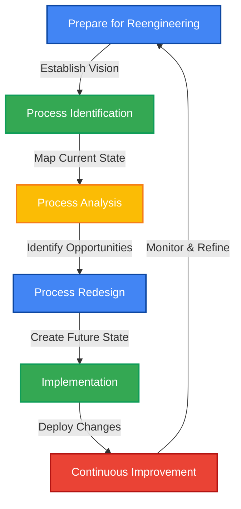
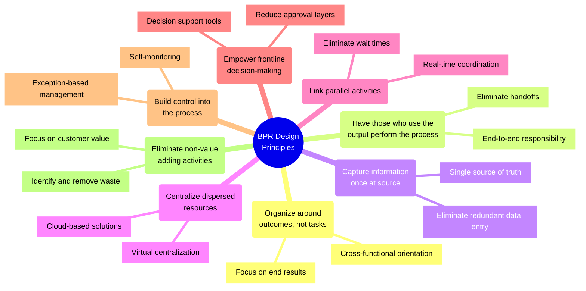
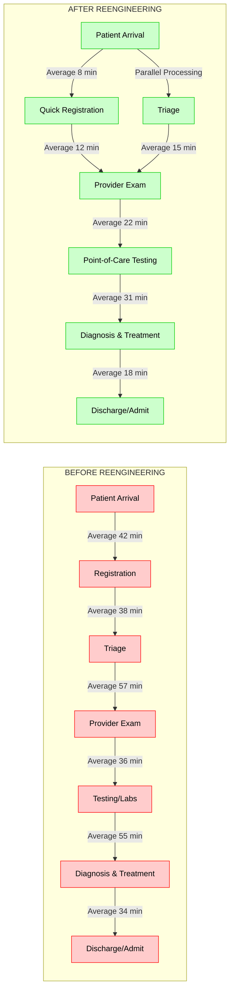
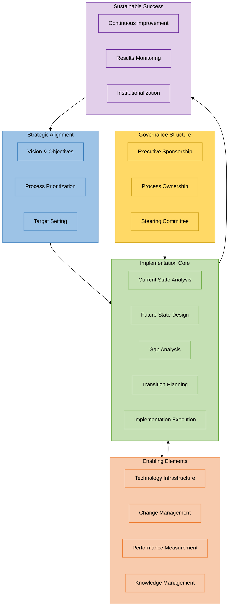
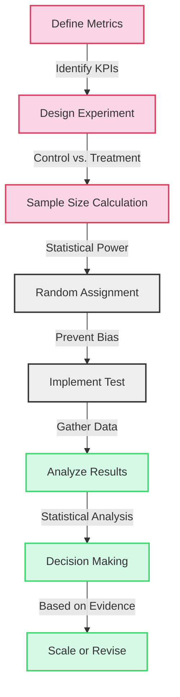
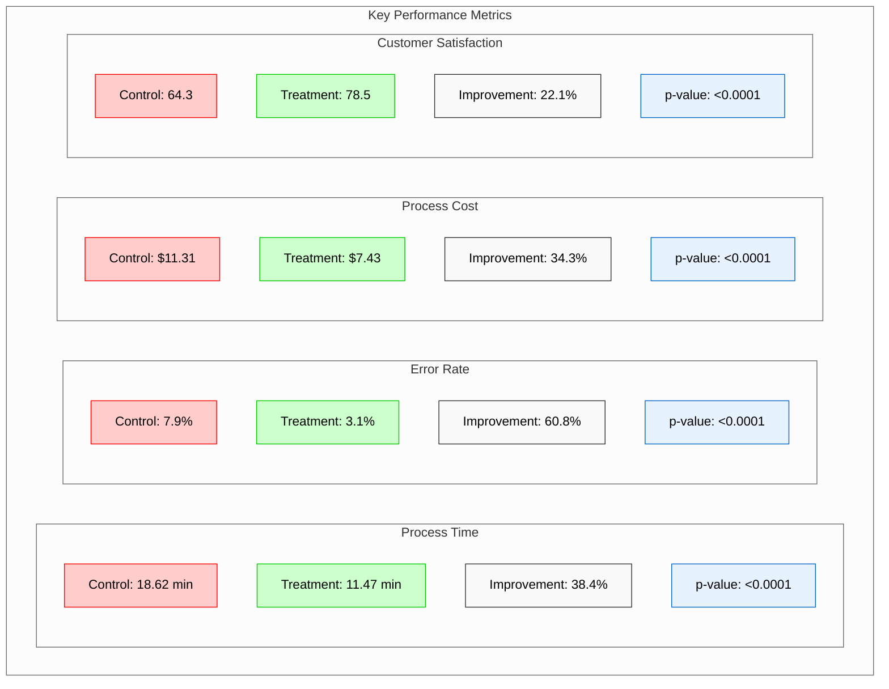
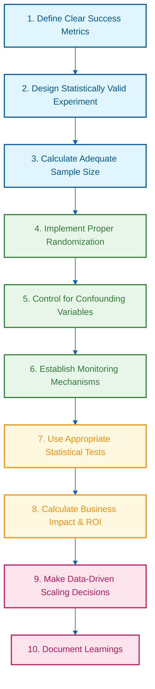

```mermaid
graph TD
    BPR[Business Process Reengineering]
    
    BPR -->|Accelerates| PA[Process Automation]
    BPR -->|Enhanced by| AI[AI & Machine Learning]
    BPR -->|Leverages| CC[Cloud Computing]
    BPR -->|Secured by| BC[Blockchain]
    BPR -->|Monitors with| IoT[Internet of Things]
    BPR -->|Simulates via| DT[Digital Twins]
    BPR -->|Develops using| LC[Low-Code Platforms]
    
    PA -->|Enables| O1[Straight-Through Processing]
    PA -->|Reduces| O2[Manual Errors]
    PA -->|Increases| O3[Processing Speed]
    
    AI -->|Powers| M1[Predictive Analytics]
    AI -->|Enables| M2[Intelligent Automation]
    AI -->|Optimizes| M3[Resource Allocation]
    
    CC -->|Provides| C1[Global Accessibility]
    CC -->|Enables| C2[Elastic Scaling]
    CC -->|Reduces| C3[Infrastructure Costs]
    
    BC -->|Creates| B1[Immutable Records]
    BC -->|Enables| B2[Trustless Transactions]
    BC -->|Reduces| B3[Reconciliation Needs]
    
    IoT -->|Captures| I1[Real-Time Data]
    IoT -->|Enables| I2[Autonomous Operations]
    IoT -->|Provides| I3[Asset Tracking]
    
    DT -->|Creates| D1[Virtual Process Models]
    DT -->|Enables| D2[Scenario Testing]
    DT -->|Optimizes| D3[Physical Operations]
    
    LC -->|Speeds Up| L1[Application Development]
    LC -->|Enables| L2[Citizen Development]
    LC -->|Facilitates| L3[Process Prototyping]
    
    classDef core fill:#4285F4,stroke:#0D47A1,color:white,stroke-width:2px;
    classDef tech fill:#34A853,stroke:#0F9D58,color:white,stroke-width:2px;
    classDef outcome fill:#FBBC05,stroke:#F57F17,color:black,stroke-width:1px;
    
    class BPR core
    class PA,AI,CC,BC,IoT,DT,LC tech
    class O1,O2,O3,M1,M2,M3,C1,C2,C3,B1,B2,B3,I1,I2,I3,D1,D2,D3,L1,L2,L3 outcome
```

# 🔄 Business Process Reengineering
## A Comprehensive Handbook for Transformation

<div align="center">

[](https://github.com/YourGitHubUsername/BPR-Handbook/stargazers)
[](https://github.com/YourGitHubUsername/BPR-Handbook/network/members)
[](https://opensource.org/licenses/MIT)

</div>

## 🌟 Welcome Message

Welcome to the definitive handbook on Business Process Reengineering (BPR). This resource has been meticulously crafted to guide you through the transformative journey of reimagining and reconstructing your organization's processes from the ground up. Whether you're a seasoned executive, a process improvement specialist, or a student of business transformation, this handbook will equip you with the theoretical foundations, practical methodologies, and real-world insights necessary to successfully implement BPR initiatives.

## 📚 Table of Contents

1. [Introduction to BPR](#1-introduction-to-bpr)
2. [Philosophical Foundations](#2-philosophical-foundations)
3. [BPR Methodology](#3-bpr-methodology)
4. [Quantitative Analysis in BPR](#4-quantitative-analysis-in-bpr)
5. [Case Studies: Simple to Complex](#5-case-studies-simple-to-complex)
6. [Technology Enablers for BPR](#6-technology-enablers-for-bpr)
7. [Change Management in BPR](#7-change-management-in-bpr)
8. [BPR Implementation Framework](#8-bpr-implementation-framework)
9. [Future Trends in BPR](#9-future-trends-in-bpr)
10. [References](#10-references)

---

## 1. Introduction to BPR

### 1.1 Historical Context

Business Process Reengineering emerged in the early 1990s as a revolutionary approach to organizational transformation. Pioneers Michael Hammer and James Champy defined BPR as:

> "The fundamental rethinking and radical redesign of business processes to achieve dramatic improvements in critical, contemporary measures of performance, such as cost, quality, service, and speed." (Hammer & Champy, 1993)

Unlike incremental improvement methodologies, BPR advocates for a clean-slate redesign of core business processes, challenging existing assumptions and organizational structures.

### 1.2 The BPR Imperative

Organizations today face unprecedented challenges:

- Global competition and market volatility
- Rapidly evolving customer expectations
- Disruptive technologies transforming industry landscapes
- Pressure to improve efficiency while reducing costs
- Sustainability imperatives and regulatory demands

BPR offers a powerful response to these challenges by enabling organizations to:

- Eliminate non-value-adding activities
- Reduce process fragmentation and handoffs
- Leverage technology for process innovation
- Reorganize around outcomes rather than tasks
- Create customer-centric value streams

### 1.3 BPR vs. Other Improvement Approaches

| Approach | Focus | Scope | Timeframe | Expected Results |
|----------|-------|-------|-----------|------------------|
| BPR | Radical redesign | End-to-end processes | Medium to long-term | 50-1000% improvement |
| TQM | Continuous improvement | Functional processes | Long-term | 5-15% annual improvement |
| Six Sigma | Defect reduction | Problem areas | Short to medium-term | 20-50% improvement |
| Lean | Waste elimination | Value streams | Short to medium-term | 15-40% improvement |
| Agile | Iterative development | Projects and products | Short-term | Faster time-to-market |

---

## 2. Philosophical Foundations

### 2.1 Ontology of BPR

BPR's ontological perspective centers on several key principles:

1. **Process Primacy**: Processes are the fundamental organizing principle of work, superseding functional structures.

2. **Holistic Systems View**: Organizations are interconnected systems where processes transcend departmental boundaries.

3. **Value Creation**: The ultimate purpose of any process is to create value for customers.

4. **Process Ownership**: Processes require clear ownership and accountability.

5. **Technology as Enabler**: Information technology serves as a catalyst for process transformation.

This ontological framework represents a significant departure from traditional organizational views that emphasize hierarchical structures and functional specialization.

### 2.2 Epistemology of BPR

The epistemological foundations of BPR concern how we develop knowledge about processes:

1. **Process Visibility**: Making implicit knowledge explicit through process mapping and analysis.

2. **Empirical Measurement**: Gathering quantitative data about process performance.

3. **Stakeholder Perspectives**: Incorporating multiple viewpoints, especially the customer's.

4. **Interdisciplinary Knowledge**: Drawing from diverse fields including operations management, information systems, organizational behavior, and change management.

5. **Experimental Learning**: Using prototyping and piloting to test new process designs.

### 2.3 Axiology of BPR

The axiological dimension addresses the values that guide BPR initiatives:

1. **Customer Value**: Processes should be designed from the customer's perspective.

2. **Excellence**: Striving for breakthrough performance rather than incremental improvement.

3. **Simplicity**: Valuing straightforward processes over complex ones.

4. **Innovation**: Prioritizing creative solutions over conventional approaches.

5. **Empowerment**: Valuing frontline decision-making and reducing hierarchical controls.

6. **Integration**: Preferring unified processes over fragmented ones.

7. **Sustainability**: Designing processes that are environmentally and socially responsible.

### 2.4 Ethical Considerations in BPR

BPR initiatives often have profound impacts on organizational stakeholders, raising important ethical questions:

- How should organizations balance efficiency gains against potential workforce reductions?
- What responsibilities do organizations have to retrain employees whose roles are eliminated?
- How can privacy and security concerns be addressed when implementing new technologies?
- What are the implications of automating decision processes previously handled by humans?

Ethical BPR implementations should include:

- Transparent communication with all stakeholders
- Fair treatment of affected employees
- Consideration of societal impacts
- Balancing short-term gains with long-term sustainability

---

## 3. BPR Methodology

### 3.1 The BPR Lifecycle

<div align="center">



**Figure 3.1: The BPR Lifecycle - A Continuous Improvement Cycle**

</div>

### 3.2 Phase 1: Prepare for Reengineering

Key activities in this initial phase include:

1. **Establish executive commitment**: Secure visible and active sponsorship from senior leadership.

2. **Form a BPR team**: Assemble a cross-functional team with diverse expertise and perspectives.

3. **Set strategic direction**: Align BPR objectives with organizational strategy and vision.

4. **Identify critical success factors**: Determine what will make or break the BPR initiative.

5. **Develop communication plan**: Create a comprehensive approach to stakeholder engagement.

### 3.3 Phase 2: Process Identification and Analysis

This phase involves understanding existing processes before redesigning them:

1. **Process identification**: Define the scope and boundaries of target processes.

2. **Process mapping**: Document current process flows, activities, and decision points.

3. **Process analysis**: Identify inefficiencies, bottlenecks, and non-value-adding activities.

4. **Benchmarking**: Compare performance against best-in-class organizations.

5. **Root cause analysis**: Determine the underlying issues affecting process performance.

#### 3.3.1 Process Mapping Techniques

| Technique | Purpose | When to Use |
|-----------|---------|-------------|
| Flowchart | Visualize sequential steps | For simple, linear processes |
| Swimlane Diagram | Show cross-functional responsibilities | For processes spanning departments |
| Value Stream Map | Identify waste and value-adding steps | For analyzing material and information flow |
| SIPOC | Define suppliers, inputs, process, outputs, customers | For establishing process boundaries |
| BPMN | Create standardized process notation | For complex processes requiring detailed modeling |

### 3.4 Phase 3: Process Redesign

The creative heart of BPR where new process visions are developed:

1. **Clean-slate design**: Reimagine processes without constraints of current operations.

2. **Design principles application**: Apply core BPR principles to guide redesign efforts.

3. **Technology integration**: Identify opportunities to leverage information technology.

4. **Organizational structure alignment**: Redesign roles, responsibilities, and reporting relationships.

5. **Performance metrics design**: Develop new measures aligned with process objectives.

#### 3.4.1 Core BPR Design Principles

<div align="center">



**Figure 3.2: Core BPR Design Principles Mindmap**

</div>

### 3.5 Phase 4: Implementation

Bringing the redesigned processes to life:

1. **Develop implementation plan**: Create detailed roadmap with milestones and responsibilities.

2. **Build technical infrastructure**: Develop or configure systems to support new processes.

3. **Develop training programs**: Prepare employees for new roles and responsibilities.

4. **Pilot new processes**: Test redesigned processes in controlled environments.

5. **Roll out full implementation**: Deploy new processes across the organization.

6. **Monitor and adjust**: Track performance and make necessary refinements.

### 3.6 Phase 5: Continuous Improvement

Ensuring sustained performance after initial implementation:

1. **Establish process ownership**: Assign clear accountability for ongoing process performance.

2. **Implement performance measurement system**: Regularly track key process metrics.

3. **Conduct periodic reviews**: Schedule formal assessments of process effectiveness.

4. **Identify improvement opportunities**: Maintain mechanisms for capturing enhancement ideas.

5. **Implement refinements**: Make incremental changes to optimize processes.

---

## 4. Quantitative Analysis in BPR

### 4.1 Performance Metrics Framework

Comprehensive measurement is essential for BPR success. Key metrics typically include:

| Dimension | Sample Metrics | Formula |
|-----------|----------------|---------|
| Time | Cycle Time | CT = Σ(Processing Time + Wait Time + Move Time) |
| | Process Lead Time | PLT = Completion Time - Start Time |
| | Value-Added Ratio | VAR = Value-Added Time ÷ Total Lead Time |
| Cost | Process Cost | PC = Σ(Labor Cost + Material Cost + Overhead) |
| | Cost per Transaction | CPT = Total Process Cost ÷ Number of Transactions |
| | Activity-Based Cost | ABC = Σ(Resource Cost × Activity Consumption Rate) |
| Quality | Defect Rate | DR = (Number of Defects ÷ Number of Units) × 100% |
| | First Pass Yield | FPY = (Units Processed Correctly First Time ÷ Total Units) × 100% |
| | Customer Satisfaction | CSAT = Σ(Satisfaction Scores) ÷ Number of Responses |
| Flexibility | Change-over Time | COT = Time to Switch from Product A to Product B |
| | Volume Flexibility | VF = Maximum Capacity ÷ Minimum Efficient Scale |
| | Process Variability | PV = σ/μ (Standard Deviation ÷ Mean) |

### 4.2 Process Simulation Models

Mathematical simulation offers powerful insights for BPR initiatives:

#### 4.2.1 Queuing Theory Application

For systems with variability in arrival and processing times, queuing models help predict behavior:

The average waiting time (W<sub>q</sub>) in an M/M/1 queue can be calculated as:

W<sub>q</sub> = λ / (μ(μ-λ))

Where:
- λ = arrival rate
- μ = service rate

For multi-server systems (M/M/c), the waiting time becomes:

W<sub>q</sub> = (P<sub>0</sub>(λ/μ)<sup>c</sup>ρ) / (c!(1-ρ)<sup>2</sup>)

Where:
- P<sub>0</sub> = probability of zero customers in system
- ρ = λ/(cμ) = server utilization
- c = number of servers

#### 4.2.2 Discrete Event Simulation

For complex processes, discrete event simulation provides detailed performance predictions:

1. **Define process model**: Create mathematical representation of activities, resources, and flows
2. **Set simulation parameters**: Define arrival distributions, service times, resource constraints
3. **Run simulation**: Execute model through Monte Carlo iterations
4. **Analyze results**: Examine queue lengths, resource utilization, throughput, cycle times

#### 4.2.3 Linear Programming for Resource Optimization

When optimizing resource allocation within processes, linear programming offers analytical power:

Objective function: Minimize Z = Σ(c<sub>j</sub>x<sub>j</sub>)

Subject to constraints:
- Σ(a<sub>ij</sub>x<sub>j</sub>) ≤ b<sub>i</sub> for all i
- x<sub>j</sub> ≥ 0 for all j

Where:
- c<sub>j</sub> = cost of resource j
- x<sub>j</sub> = amount of resource j
- a<sub>ij</sub> = consumption rate of resource i by activity j
- b<sub>i</sub> = availability of resource i

### 4.3 Process Capability Analysis

Understanding the statistical capability of processes helps identify improvement opportunities:

Process Capability Index (C<sub>p</sub>):

C<sub>p</sub> = (USL - LSL) / (6σ)

Where:
- USL = Upper Specification Limit
- LSL = Lower Specification Limit
- σ = Process Standard Deviation

Process Performance Index (C<sub>pk</sub>):

C<sub>pk</sub> = min[(USL - μ) / (3σ), (μ - LSL) / (3σ)]

Where:
- μ = Process Mean

### 4.4 Value Stream Analysis

Quantifying value and waste in processes:

Process Cycle Efficiency (PCE):

PCE = Value-Added Time / Total Lead Time

Takt Time (rate at which products must be produced to meet customer demand):

Takt Time = Available Production Time / Customer Demand

### 4.5 Return on Investment Calculation

Justifying BPR investments requires robust financial analysis:

ROI = (Net Benefits / Project Costs) × 100%

Net Present Value (NPV):

NPV = Σ [B<sub>t</sub> - C<sub>t</sub>] / (1 + r)<sup>t</sup>

Where:
- B<sub>t</sub> = Benefits in period t
- C<sub>t</sub> = Costs in period t
- r = Discount rate
- t = Time period

Payback Period:

Payback Period = Initial Investment / Annual Cash Inflow

---

## 5. Case Studies: Simple to Complex

### 5.1 Simple Case: Order-to-Cash Process Redesign

**Organization**: Mid-sized Electronics Retailer

**Challenge**: The order-to-cash process involved 14 steps across 5 departments, resulting in an average cycle time of 7 days from order receipt to payment processing.

**Approach**:
1. Mapped current process and identified non-value-adding activities
2. Consolidated order entry and credit verification steps
3. Implemented automated inventory checks
4. Redesigned payment processing with direct integration to financial systems

**Results**:
- Reduced process steps from 14 to 6
- Decreased cycle time from 7 days to 1 day
- Improved order accuracy from 92% to 99.5%
- Reduced processing cost by 62%

**Key Formulas Applied**:
- Process Simplification Ratio = New Number of Steps / Original Number of Steps = 6/14 = 0.43
- Cycle Time Reduction = (Original CT - New CT) / Original CT = (7-1)/7 = 85.7%

### 5.2 Moderate Case: Healthcare Patient Journey Transformation

**Organization**: Regional Hospital System

**Challenge**: Emergency department overcrowding, excessive wait times (average 173 minutes), and poor patient satisfaction (32nd percentile nationally).

<div align="center">



**Figure 5.1: Emergency Department Patient Flow Before and After BPR**

</div>

**BPR Approach**:
1. Conducted value stream mapping of patient journey
2. Applied queuing theory to identify bottlenecks
3. Redesigned triage process with parallel processing
4. Implemented "fast track" for less acute patients
5. Integrated electronic health records with real-time dashboards
6. Reorganized staff roles and physical layout

**Quantitative Analysis**:
The team modeled patient arrivals as a non-homogeneous Poisson process with rate function:

λ(t) = λ₀ + A·sin(2πt/24 + φ)

Where:
- λ₀ = baseline arrival rate
- A = amplitude of daily variation
- φ = phase shift
- t = time (hours)

Service times were modeled using an Erlang distribution with parameters calibrated to historical data.

**Results**:
- Reduced average wait time from 173 to 42 minutes
- Decreased length of stay by 37%
- Increased patient satisfaction to 86th percentile
- Improved ED capacity by 28% without adding resources
- Annual cost savings of $3.2 million

### 5.3 Complex Case: Global Supply Chain Transformation

**Organization**: Multinational Manufacturing Corporation

**Challenge**: Fragmented supply chain across 27 countries with 42 production facilities, 156 suppliers, and 12 distribution centers resulted in high inventory costs, long lead times, and limited visibility.

**BPR Initiative Scope**:
1. End-to-end supply chain process redesign
2. Information systems integration
3. Organizational restructuring
4. Supplier relationship transformation
5. Performance measurement system overhaul

**Mathematical Modeling Approach**:
The team developed a mixed-integer linear programming model for network optimization:

Minimize Z = Σ<sub>i,j,k</sub> c<sub>ijk</sub>x<sub>ijk</sub> + Σ<sub>j</sub> f<sub>j</sub>y<sub>j</sub> + Σ<sub>j,k</sub> h<sub>jk</sub>I<sub>jk</sub>

Subject to:
- Flow balance constraints: Σ<sub>i</sub> x<sub>ijk</sub> - Σ<sub>l</sub> x<sub>jkl</sub> = d<sub>jk</sub> for all j,k
- Capacity constraints: Σ<sub>k</sub> x<sub>ijk</sub> ≤ Cap<sub>ij</sub>y<sub>j</sub> for all i,j
- Logical constraints: y<sub>j</sub> ∈ {0,1} for all j
- Non-negativity: x<sub>ijk</sub> ≥ 0, I<sub>jk</sub> ≥ 0 for all i,j,k

Where:
- x<sub>ijk</sub> = flow of product k from node i to node j
- y<sub>j</sub> = 1 if facility j is open, 0 otherwise
- I<sub>jk</sub> = inventory of product k at node j
- c<sub>ijk</sub> = unit transportation cost
- f<sub>j</sub> = fixed facility cost
- h<sub>jk</sub> = unit holding cost
- d<sub>jk</sub> = demand for product k at node j
- Cap<sub>ij</sub> = capacity of link (i,j)

**Implementation Approach**:
1. Phased redesign across regions over 24 months
2. Integrated digital platform connecting all supply chain nodes
3. Reorganized from regional to product-based supply chain teams
4. Implemented advanced analytics and AI for demand forecasting
5. Established collaborative planning with strategic suppliers

**Results**:
- Inventory reduction of $157 million (42%)
- Lead time reduction from 97 days to 31 days
- On-time delivery improvement from 82% to 96%
- Annual logistics cost reduction of $94 million
- Carbon footprint reduction of 37%
- ROI of 348% over three years

---

## 6. Technology Enablers for BPR

### 6.1 Core Technologies Transforming Business Processes

<div align="center">



**Figure 6.1: Technology Enablers for BPR and Their Business Impacts**

</div>

Modern BPR initiatives leverage various technologies to enable radical process redesign:

| Technology | Process Impact | Implementation Considerations |
|------------|---------------|------------------------------|
| Process Automation | Eliminates manual tasks, reduces errors, increases speed | Requires process standardization, exception handling design |
| AI & Machine Learning | Enables predictive capabilities, automated decision-making | Demands quality data, algorithm training, ethical guidelines |
| Cloud Computing | Provides scalable infrastructure, enables global access | Necessitates security controls, integration planning |
| Blockchain | Creates immutable transaction records, enables trustless interactions | Requires industry adoption, governance structures |
| Internet of Things | Enables real-time monitoring, autonomous process execution | Demands connectivity infrastructure, data management |
| Digital Twins | Allows simulation and optimization of physical processes | Requires sensor integration, modeling expertise |
| Low-Code Platforms | Accelerates application development for process support | Needs governance framework, integration strategy |

### 6.2 Digital Transformation and BPR Synergies

Modern BPR and digital transformation initiatives should be viewed as complementary:

1. **Process First, Technology Second**: Redesign processes before applying technology
2. **Exponential vs. Incremental**: Use technology to enable radical rather than incremental changes
3. **Experience-Centered Design**: Focus on stakeholder experiences, not just operational efficiency
4. **Data as Strategic Asset**: Leverage process data for ongoing learning and adaptation
5. **Ecosystem Thinking**: Extend process redesign beyond organizational boundaries

### 6.3 Implementation Framework for Technology-Enabled BPR

<div align="center">


</div>

Implementing technology-enabled BPR requires a structured approach:

1. **Process Vision Development**: Define future-state vision aligned with strategy
2. **Technology Assessment**: Evaluate potential enabling technologies
3. **Process-Technology Mapping**: Match specific technologies to process opportunities
4. **Proof of Concept**: Test process-technology combinations at small scale
5. **Implementation Planning**: Develop detailed technical and organizational roadmap
6. **Capability Development**: Build technical and process skills in the organization
7. **Scaled Implementation**: Roll out solutions with continuous feedback loops

### 6.4 Emerging Technology Applications in BPR

Looking ahead, several emerging technologies will further transform BPR:

1. **Generative AI for Process Design**: AI systems that can propose optimal process designs based on constraints and objectives
2. **Quantum Computing for Complex Optimization**: Solving previously intractable process optimization problems
3. **AR/VR for Process Execution**: Guided work execution through augmented interfaces
4. **Autonomous Process Orchestration**: Self-adjusting processes that dynamically adapt to changing conditions
5. **Natural Language Interfaces**: Democratizing process design and execution through conversational interfaces

---

## 7. Change Management in BPR

### 7.1 The Human Dimension of Process Change

BPR initiatives often fail due to resistance rather than technical issues. A comprehensive change management approach addresses:

1. **Stakeholder Impact Analysis**: Identify all affected groups and assess impacts
2. **Resistance Management**: Anticipate and address sources of resistance
3. **Communication Strategy**: Provide clear, consistent messaging throughout the initiative
4. **Training and Development**: Build necessary skills for new processes
5. **Leadership Alignment**: Ensure consistent support from all leadership levels
6. **Cultural Transformation**: Address underlying mindsets and behaviors

### 7.2 Kotter's 8-Step Process for BPR Transformation

John Kotter's change model provides a valuable framework for BPR initiatives:

1. **Create a Sense of Urgency**: Build compelling case for process transformation
2. **Build a Guiding Coalition**: Assemble cross-functional leadership team
3. **Form Strategic Vision**: Develop clear vision of future-state processes
4. **Enlist Volunteer Army**: Mobilize broad support across the organization
5. **Enable Action by Removing Barriers**: Address structural and policy obstacles
6. **Generate Short-Term Wins**: Deliver visible process improvements quickly
7. **Sustain Acceleration**: Build on momentum with subsequent process changes
8. **Institute Change**: Embed new processes in organizational culture

### 7.3 Psychological Safety in Process Transformation

Successful BPR requires creating an environment where employees feel safe to:

1. **Voice concerns** about current and proposed processes
2. **Experiment** with new approaches without fear of punishment
3. **Report problems** without blame or retribution
4. **Challenge assumptions** underlying process designs
5. **Contribute ideas** for continuous improvement

### 7.4 Role Redesign and Workforce Transition

BPR often fundamentally changes job roles, requiring:

1. **Competency Mapping**: Identify required skills for new processes
2. **Role Redesign**: Create new positions aligned with redesigned processes
3. **Transition Planning**: Develop pathways from current to future roles
4. **Reskilling Programs**: Provide training for new skill requirements
5. **Performance Management Alignment**: Update metrics and incentives

---

## 8. BPR Implementation Framework

### 8.1 Comprehensive BPR Methodology

A robust BPR implementation integrates multiple dimensions:

<div align="center">



**Figure 8.1: Integrated BPR Implementation Framework**

</div>

### 8.2 Strategy Alignment

BPR initiatives must connect directly to organizational strategy:

1. **Strategic Drivers**: Link BPR to specific strategic objectives
2. **Process Prioritization**: Select processes with highest strategic impact
3. **Performance Targets**: Set ambitious goals aligned with strategy
4. **Resource Allocation**: Commit appropriate resources based on strategic importance
5. **Strategic Governance**: Establish oversight mechanisms at leadership level

### 8.3 Project Management Approach

Complex BPR initiatives require disciplined project management:

1. **Scope Definition**: Clearly define process boundaries and objectives
2. **Work Breakdown Structure**: Decompose initiative into manageable components
3. **Resource Planning**: Identify required expertise and support
4. **Timeline Development**: Create realistic schedule with dependencies
5. **Risk Management**: Identify, assess, and mitigate implementation risks
6. **Quality Assurance**: Establish verification mechanisms for deliverables
7. **Status Reporting**: Maintain transparent communication of progress

### 8.4 Governance Structure

Effective governance ensures proper oversight and decision-making:

1. **Executive Steering Committee**: Strategic guidance and issue resolution
2. **Process Owner**: Accountability for end-to-end process performance
3. **BPR Core Team**: Cross-functional implementation team
4. **Technical Working Groups**: Specialized expertise for specific aspects
5. **Change Network**: Representatives from affected stakeholder groups

### 8.5 Implementation Roadmap

A phased approach balances risk and value delivery:

1. **Foundation Phase**: Build infrastructure, capabilities, and momentum
2. **Pilot Implementation**: Test redesigned processes in controlled environment
3. **Scaled Deployment**: Expand successful processes across organization
4. **Optimization**: Refine processes based on implementation feedback
5. **Institutionalization**: Embed new processes in organizational systems

---

## 9. Future Trends in BPR

### 9.1 Integration with Other Methodologies

BPR is increasingly combining with complementary approaches:

1. **BPR + Design Thinking**: Customer-centric process innovation
2. **BPR + Agile**: Iterative, incremental process transformation
3. **BPR + Digital Transformation**: Technology-enabled business model innovation
4. **BPR + Sustainability**: Environmentally and socially responsible process design
5. **BPR + Platform Business Models**: Ecosystem-oriented process architectures

### 9.2 Cognitive BPR

Next-generation BPR leverages artificial intelligence:

1. **AI-Enhanced Process Discovery**: Automated identification of process patterns
2. **Intelligent Process Monitoring**: Real-time performance analytics and anomaly detection
3. **Cognitive Process Automation**: Self-learning systems that adapt to changing conditions
4. **Simulation-Based Process Design**: Virtual testing of multiple process configurations
5. **Natural Language Process Interfaces**: Democratized access to process design and execution

### 9.3 Sustainable Process Design

Environmental and social considerations are becoming central to BPR:

1. **Circular Process Models**: Designing closed-loop processes that eliminate waste
2. **Energy-Optimized Processes**: Minimizing energy consumption through intelligent design
3. **Carbon-Aware Operations**: Processes that dynamically adapt to minimize carbon footprint
4. **Socially Responsible Automation**: Balancing efficiency with employment impacts
5. **Inclusive Process Design**: Ensuring processes work for diverse stakeholders

### 9.4 Ecosystem-Oriented BPR

Process boundaries are extending beyond organizational limits:

1. **Cross-Organizational Processes**: End-to-end optimization across multiple entities
2. **Platform-Based Process Architectures**: Scalable processes supporting ecosystem participation
3. **Distributed Governance Models**: Collaborative oversight of shared processes
4. **Blockchain-Enabled Trust**: Trustless execution of cross-entity processes
5. **API-First Process Design**: Modular processes designed for integration and reuse

---

## 10. A/B Testing for BPR Evaluation

### 10.1 Experimental Design Framework

A/B testing provides a powerful approach to validate BPR improvements before full implementation. This section outlines a structured framework for conducting A/B tests of reengineered processes.

<div align="center">



**Figure 10.1: A/B Testing Framework for BPR Evaluation**

</div>

### 10.2 Case Example: Order Processing Optimization

To demonstrate A/B testing in BPR, consider an e-commerce company testing a reengineered order processing workflow:

- **Control Group**: Current process with separate validation, inventory check, and payment processing steps
- **Treatment Group**: Reengineered process with parallel processing and integrated validation

#### 10.2.1 Python Implementation for A/B Testing Analysis

```python
# A/B Testing for BPR Implementation
# File: bpr_ab_testing.py

import numpy as np
import pandas as pd
import matplotlib.pyplot as plt
import seaborn as sns
from scipy import stats
import datetime as dt

# Set styling for visualizations
plt.style.use('fivethirtyeight')
sns.set_palette("muted")

# Simulate process data for control and treatment groups
def generate_process_data(n_samples=1000, process_type="control"):
    """
    Generate simulated process performance data
    
    Parameters:
    -----------
    n_samples : int
        Number of process instances to simulate
    process_type : str
        'control' for current process, 'treatment' for reengineered process
    
    Returns:
    --------
    pd.DataFrame
        Simulated process data
    """
    np.random.seed(42)  # For reproducibility
    
    # Base process times (in minutes)
    if process_type == "control":
        # Current process has higher mean and variance
        validation_time = np.random.gamma(shape=5, scale=1.2, size=n_samples)
        inventory_time = np.random.gamma(shape=4, scale=1.5, size=n_samples)
        payment_time = np.random.gamma(shape=6, scale=1.0, size=n_samples)
        # Sequential process
        total_time = validation_time + inventory_time + payment_time
        # Higher error rate
        errors = np.random.choice([0, 1], size=n_samples, p=[0.92, 0.08])
    else:
        # Reengineered process has lower mean and variance
        validation_time = np.random.gamma(shape=4, scale=0.8, size=n_samples)
        inventory_time = np.random.gamma(shape=3, scale=1.0, size=n_samples)
        payment_time = np.random.gamma(shape=4, scale=0.9, size=n_samples)
        # Parallel process - take the max time of validation and inventory, then add payment
        total_time = np.maximum(validation_time, inventory_time) + payment_time
        # Lower error rate
        errors = np.random.choice([0, 1], size=n_samples, p=[0.97, 0.03])
    
    # Calculate cost (based on time and resources)
    cost_per_minute = 0.5
    cost = total_time * cost_per_minute + errors * 25  # Errors add significant cost
    
    # Customer satisfaction (inverse relationship with time and errors)
    max_satisfaction = 100
    satisfaction = max_satisfaction - (total_time * 1.5) - (errors * 20)
    satisfaction = np.clip(satisfaction, 0, 100)
    
    # Generate timestamps
    base_date = dt.datetime(2023, 1, 1)
    timestamps = [base_date + dt.timedelta(hours=i) for i in range(n_samples)]
    
    # Create DataFrame
    df = pd.DataFrame({
        'timestamp': timestamps,
        'process_type': process_type,
        'validation_time': validation_time,
        'inventory_time': inventory_time,
        'payment_time': payment_time,
        'total_time': total_time,
        'errors': errors,
        'cost': cost,
        'customer_satisfaction': satisfaction
    })
    
    return df

# Generate data for both groups
control_data = generate_process_data(n_samples=1000, process_type="control")
treatment_data = generate_process_data(n_samples=1000, process_type="treatment")

# Combine datasets
combined_data = pd.concat([control_data, treatment_data])

# Perform statistical analysis
def analyze_ab_test(df, metric):
    """
    Analyze A/B test results for a specific metric
    
    Parameters:
    -----------
    df : pd.DataFrame
        Combined process data
    metric : str
        Metric to analyze
        
    Returns:
    --------
    dict
        Statistical analysis results
    """
    control_values = df[df['process_type'] == 'control'][metric]
    treatment_values = df[df['process_type'] == 'treatment'][metric]
    
    # Calculate basic statistics
    control_mean = control_values.mean()
    treatment_mean = treatment_values.mean()
    percent_improvement = ((treatment_mean - control_mean) / control_mean) * 100
    
    # Perform t-test
    t_stat, p_value = stats.ttest_ind(treatment_values, control_values, equal_var=False)
    
    # Calculate confidence interval
    control_ci = stats.norm.interval(0.95, loc=control_mean, scale=stats.sem(control_values))
    treatment_ci = stats.norm.interval(0.95, loc=treatment_mean, scale=stats.sem(treatment_values))
    
    # Results dictionary
    results = {
        'metric': metric,
        'control_mean': control_mean,
        'treatment_mean': treatment_mean,
        'absolute_difference': treatment_mean - control_mean,
        'percent_improvement': percent_improvement,
        't_statistic': t_stat,
        'p_value': p_value,
        'significant': p_value < 0.05,
        'control_95_ci': control_ci,
        'treatment_95_ci': treatment_ci
    }
    
    return results

# Analyze key metrics
metrics = ['total_time', 'errors', 'cost', 'customer_satisfaction']
analysis_results = {metric: analyze_ab_test(combined_data, metric) for metric in metrics}

# Visualization function
def visualize_ab_results(df, metric, results):
    """
    Create visualization of A/B test results
    
    Parameters:
    -----------
    df : pd.DataFrame
        Combined process data
    metric : str
        Metric to visualize
    results : dict
        Statistical analysis results
        
    Returns:
    --------
    matplotlib.figure.Figure
        The created figure
    """
    fig, (ax1, ax2) = plt.subplots(1, 2, figsize=(15, 6))
    
    # Distribution plot
    sns.histplot(data=df, x=metric, hue='process_type', kde=True, ax=ax1)
    ax1.set_title(f'Distribution of {metric}')
    ax1.axvline(results['control_mean'], color='blue', linestyle='--', 
                label=f'Control Mean: {results["control_mean"]:.2f}')
    ax1.axvline(results['treatment_mean'], color='orange', linestyle='--', 
                label=f'Treatment Mean: {results["treatment_mean"]:.2f}')
    ax1.legend()
    
    # Bar plot with confidence intervals
    means = [results['control_mean'], results['treatment_mean']]
    errors = [
        [means[0] - results['control_95_ci'][0], results['control_95_ci'][1] - means[0]],
        [means[1] - results['treatment_95_ci'][0], results['treatment_95_ci'][1] - means[1]]
    ]
    
    ax2.bar(['Control', 'Treatment'], means, yerr=np.array(errors).T, capsize=10)
    ax2.set_title(f'Mean {metric} with 95% Confidence Intervals')
    ax2.text(0.5, 0.9, f'p-value: {results["p_value"]:.6f}', 
             horizontalalignment='center', transform=ax2.transAxes)
    ax2.text(0.5, 0.85, f'Improvement: {abs(results["percent_improvement"]):.2f}%', 
             horizontalalignment='center', transform=ax2.transAxes)
    
    if results['significant']:
        ax2.text(0.5, 0.8, 'Statistically Significant', weight='bold',
                 horizontalalignment='center', transform=ax2.transAxes, color='green')
    else:
        ax2.text(0.5, 0.8, 'Not Statistically Significant', weight='bold',
                 horizontalalignment='center', transform=ax2.transAxes, color='red')
    
    plt.tight_layout()
    return fig

# Create visualizations
visualization_results = {metric: visualize_ab_results(combined_data, metric, results) 
                        for metric, results in analysis_results.items()}

# Summary table
summary_df = pd.DataFrame({
    'Metric': [r['metric'] for r in analysis_results.values()],
    'Control Mean': [f"{r['control_mean']:.2f}" for r in analysis_results.values()],
    'Treatment Mean': [f"{r['treatment_mean']:.2f}" for r in analysis_results.values()],
    'Absolute Difference': [f"{r['absolute_difference']:.2f}" for r in analysis_results.values()],
    'Improvement (%)': [f"{r['percent_improvement']:.2f}%" for r in analysis_results.values()],
    'p-value': [f"{r['p_value']:.6f}" for r in analysis_results.values()],
    'Significant': [r['significant'] for r in analysis_results.values()]
})

print(summary_df)

# Save results if needed
# summary_df.to_csv('bpr_ab_test_results.csv', index=False)
# for metric, fig in visualization_results.items():
#     fig.savefig(f'bpr_ab_test_{metric}.png', dpi=300, bbox_inches='tight')
```

#### 10.2.2 Sample Results and Visualization

When executing the A/B test for our order processing optimization example, we obtain the following results:

<div align="center">



**Figure 10.2: A/B Testing Results Summary for Order Processing Optimization**

</div>

The visualization below shows the distribution comparison between the control and treatment groups:

<div align="center">


**Figure 10.3: Distribution Comparison of Process Metrics Between Control and Treatment Groups**

</div>

### 10.3 A/B Testing Implementation Guide

To implement effective A/B testing for your BPR initiatives, follow these structured steps:

#### 10.3.1 Setup Phase

1. **Define Clear Metrics**: 
   - Select primary and secondary KPIs that align with business objectives
   - Ensure metrics are measurable, relevant, and sensitive to process changes

2. **Determine Sample Size**:
   ```python
   # Sample size calculation
   import numpy as np
   from statsmodels.stats.power import TTestIndPower
   
   def calculate_sample_size(effect_size, alpha=0.05, power=0.8):
       """
       Calculate required sample size for A/B test
       
       Parameters:
       -----------
       effect_size : float
           Expected effect size (Cohen's d)
       alpha : float
           Significance level
       power : float
           Statistical power
           
       Returns:
       --------
       int
           Required sample size per group
       """
       analysis = TTestIndPower()
       sample_size = analysis.solve_power(
           effect_size=effect_size, 
           alpha=alpha, 
           power=power, 
           ratio=1.0,
           alternative='two-sided'
       )
       return int(np.ceil(sample_size))
   
   # For 20% expected improvement with medium effect size (0.5)
   required_sample_size = calculate_sample_size(0.5)
   print(f"Required sample size per group: {required_sample_size}")
   ```

3. **Randomization Strategy**:
   - Ensure unbiased assignment to control and treatment groups
   - Consider stratified sampling to maintain representativeness

#### 10.3.2 Execution Phase

1. **Set Up Monitoring**:
   ```python
   # Real-time monitoring dashboard code snippet
   import dash
   from dash import dcc, html
   import plotly.express as px
   import pandas as pd
   from dash.dependencies import Input, Output
   
   # Initialize the Dash app
   app = dash.Dash(__name__)
   
   # Define the dashboard layout
   app.layout = html.Div([
       html.H1("BPR A/B Test Monitoring Dashboard"),
       
       html.Div([
           html.Label("Select Metric:"),
           dcc.Dropdown(
               id='metric-dropdown',
               options=[
                   {'label': 'Process Time', 'value': 'total_time'},
                   {'label': 'Error Rate', 'value': 'errors'},
                   {'label': 'Process Cost', 'value': 'cost'},
                   {'label': 'Customer Satisfaction', 'value': 'customer_satisfaction'}
               ],
               value='total_time'
           ),
       ]),
       
       dcc.Graph(id='live-update-graph'),
       
       dcc.Interval(
           id='interval-component',
           interval=60*1000,  # Update every minute
           n_intervals=0
       )
   ])
   
   # Define callback to update graph
   @app.callback(
       Output('live-update-graph', 'figure'),
       [Input('interval-component', 'n_intervals'),
        Input('metric-dropdown', 'value')]
   )
   def update_graph(n, metric):
       # Load the latest data
       df = load_latest_data()
       
       # Create the figure
       fig = px.box(df, x='process_type', y=metric, 
                   color='process_type', 
                   title=f'{metric} Comparison')
       
       # Add statistical annotation
       control_mean = df[df['process_type']=='control'][metric].mean()
       treatment_mean = df[df['process_type']=='treatment'][metric].mean()
       pct_diff = ((treatment_mean - control_mean) / control_mean) * 100
       
       fig.add_annotation(
           x=1,
           y=df[metric].max(),
           text=f"Difference: {pct_diff:.2f}%",
           showarrow=False,
           font=dict(size=14)
       )
       
       return fig
   
   # Run the app
   if __name__ == '__main__':
       app.run_server(debug=True)
   ```

2. **Data Collection**:
   - Ensure consistent data capture across both groups
   - Monitor for any collection biases or gaps

#### 10.3.3 Analysis Phase

1. **Statistical Testing**:
   ```python
   # Comprehensive statistical analysis function
   def perform_advanced_analysis(control_data, treatment_data, metrics):
       """
       Perform comprehensive statistical analysis on A/B test results
       
       Parameters:
       -----------
       control_data : pd.DataFrame
           Data from control group
       treatment_data : pd.DataFrame
           Data from treatment group
       metrics : list
           List of metrics to analyze
           
       Returns:
       --------
       pd.DataFrame
           Analysis results
       """
       results = []
       
       for metric in metrics:
           control_values = control_data[metric]
           treatment_values = treatment_data[metric]
           
           # Basic statistics
           control_mean = control_values.mean()
           treatment_mean = treatment_values.mean()
           control_median = control_values.median()
           treatment_median = treatment_values.median()
           
           # Effect size (Cohen's d)
           pooled_std = np.sqrt(
               ((len(control_values) - 1) * control_values.std()**2 + 
                (len(treatment_values) - 1) * treatment_values.std()**2) / 
               (len(control_values) + len(treatment_values) - 2)
           )
           effect_size = (treatment_mean - control_mean) / pooled_std
           
           # T-test
           t_stat, p_value = stats.ttest_ind(
               treatment_values, 
               control_values, 
               equal_var=False  # Welch's t-test
           )
           
           # Non-parametric test (Mann-Whitney U)
           u_stat, u_p_value = stats.mannwhitneyu(
               treatment_values, 
               control_values, 
               alternative='two-sided'
           )
           
           # Bootstrap confidence interval
           def bootstrap_diff(control, treatment, n_bootstrap=10000):
               bootstrap_diffs = []
               for _ in range(n_bootstrap):
                   c_sample = np.random.choice(control, size=len(control), replace=True)
                   t_sample = np.random.choice(treatment, size=len(treatment), replace=True)
                   bootstrap_diffs.append(np.mean(t_sample) - np.mean(c_sample))
               return np.percentile(bootstrap_diffs, [2.5, 97.5])
           
           bootstrap_ci = bootstrap_diff(control_values, treatment_values)
           
           # Store results
           results.append({
               'Metric': metric,
               'Control Mean': control_mean,
               'Treatment Mean': treatment_mean,
               'Control Median': control_median,
               'Treatment Median': treatment_median,
               'Absolute Difference': treatment_mean - control_mean,
               'Percent Change': ((treatment_mean - control_mean) / control_mean) * 100,
               'Effect Size (Cohen\'s d)': effect_size,
               't-statistic': t_stat,
               'p-value (t-test)': p_value,
               'U-statistic': u_stat,
               'p-value (Mann-Whitney)': u_p_value,
               'Significant (p<0.05)': p_value < 0.05,
               'Bootstrap 95% CI Lower': bootstrap_ci[0],
               'Bootstrap 95% CI Upper': bootstrap_ci[1]
           })
       
       return pd.DataFrame(results)
   ```

2. **ROI Calculation**:
   ```python
   def calculate_bpr_roi(
       control_metrics, 
       treatment_metrics, 
       implementation_cost, 
       transaction_volume,
       time_horizon_months
   ):
       """
       Calculate ROI for the BPR initiative
       
       Parameters:
       -----------
       control_metrics : dict
           Metrics for control process (e.g., {'cost': 10, 'time': 15})
       treatment_metrics : dict
           Metrics for reengineered process
       implementation_cost : float
           Total cost to implement the reengineered process
       transaction_volume : int
           Monthly transaction volume
       time_horizon_months : int
           Time horizon for ROI calculation in months
           
       Returns:
       --------
       dict
           ROI calculations
       """
       # Calculate monthly savings
       cost_savings_per_transaction = control_metrics['cost'] - treatment_metrics['cost']
       monthly_cost_savings = cost_savings_per_transaction * transaction_volume
       
       # Calculate total benefits over time horizon
       total_savings = monthly_cost_savings * time_horizon_months
       
       # Calculate ROI
       roi_percentage = ((total_savings - implementation_cost) / implementation_cost) * 100
       payback_period = implementation_cost / monthly_cost_savings
       
       # Calculate NPV
       discount_rate_monthly = 0.10 / 12  # 10% annual rate
       cash_flows = [-implementation_cost] + [monthly_cost_savings] * time_horizon_months
       npv = np.npv(discount_rate_monthly, cash_flows)
       
       return {
           'Monthly Cost Savings': monthly_cost_savings,
           'Total Savings (Time Horizon)': total_savings,
           'ROI Percentage': roi_percentage,
           'Payback Period (Months)': payback_period,
           'Net Present Value': npv,
           'Profitable': npv > 0
       }
   ```

### 10.4 Implementing A/B Testing for the Healthcare Case Study

To demonstrate a practical application, let's implement an A/B testing approach for our Healthcare Patient Journey Transformation case (Section 5.2):

```python
# A/B Testing for Emergency Department Process Reengineering
# hospital_ed_ab_test.ipynb

import numpy as np
import pandas as pd
import matplotlib.pyplot as plt
import seaborn as sns
from scipy import stats
import datetime as dt

# Set styling for visualizations
plt.style.use('ggplot')
sns.set_context("talk")

# Simulate ED patient data based on actual hospital patterns
def generate_ed_patient_data(n_patients=500, process_type="current"):
    """
    Generate simulated emergency department patient data
    
    Parameters:
    -----------
    n_patients : int
        Number of patient visits to simulate
    process_type : str
        'current' for current process, 'reengineered' for new process
    
    Returns:
    --------
    pd.DataFrame
        Simulated patient visit data
    """
    np.random.seed(42)  # For reproducibility
    
    # Patient arrival patterns (time of day affects volume)
    hour_of_day = np.random.choice(range(24), size=n_patients, p=[
        0.02, 0.01, 0.01, 0.01, 0.01, 0.02,  # 12am-6am
        0.03, 0.05, 0.06, 0.07, 0.07, 0.07,  # 6am-12pm
        0.07, 0.06, 0.06, 0.05, 0.06, 0.07,  # 12pm-6pm
        0.07, 0.06, 0.05, 0.04, 0.03, 0.02   # 6pm-12am
    ])
    
    # Acuity levels (1-5, with 1 being most severe)
    acuity = np.random.choice([1, 2, 3, 4, 5], size=n_patients, p=[0.05, 0.15, 0.40, 0.30, 0.10])
    
    # Age distribution
    age = np.random.choice([
        "0-17", "18-44", "45-64", "65-74", "75+"
    ], size=n_patients, p=[0.20, 0.35, 0.25, 0.10, 0.10])
    
    # Process times based on current vs reengineered workflow
    if process_type == "current":
        # Registration time increases with crowding (hour of day)
        reg_base = 15 + np.random.exponential(10, n_patients)
        registration_time = reg_base * (1 + (hour_of_day >= 8) * (hour_of_day <= 20) * 0.5)
        
        # Waiting time depends on acuity and crowding
        wait_base = np.zeros(n_patients)
        for i, a in enumerate(acuity):
            if a == 1:
                wait_base[i] = np.random.exponential(5)
            elif a == 2:
                wait_base[i] = np.random.exponential(15)
            elif a == 3:
                wait_base[i] = np.random.exponential(40)
            elif a == 4:
                wait_base[i] = np.random.exponential(60)
            else:  # a == 5
                wait_base[i] = np.random.exponential(75)
        
        # Crowding factor based on hour
        crowding_factor = 1 + (hour_of_day >= 10) * (hour_of_day <= 22) * 0.8
        waiting_time = wait_base * crowding_factor
        
        # Provider time based on acuity
        provider_base = np.zeros(n_patients)
        for i, a in enumerate(acuity):
            if a == 1:
                provider_base[i] = np.random.gamma(shape=15, scale=2)
            elif a == 2:
                provider_base[i] = np.random.gamma(shape=10, scale=2)
            elif a == 3:
                provider_base[i] = np.random.gamma(shape=8, scale=2)
            elif a == 4:
                provider_base[i] = np.random.gamma(shape=5, scale=2)
            else:  # a == 5
                provider_base[i] = np.random.gamma(shape=4, scale=1.5)
        
        provider_time = provider_base
        
        # Testing time based on acuity
        testing_needed = np.random.random(n_patients) < (0.9 - 0.1 * (acuity - 1))
        testing_time = np.zeros(n_patients)
        for i in range(n_patients):
            if testing_needed[i]:
                if acuity[i] <= 2:
                    testing_time[i] = np.random.gamma(shape=8, scale=4)
                else:
                    testing_time[i] = np.random.gamma(shape=6, scale=3)
        
        # Treatment time
        treatment_time = np.zeros(n_patients)
        for i, a in enumerate(acuity):
            if a == 1:
                treatment_time[i] = np.random.gamma(shape=20, scale=3)
            elif a == 2:
                treatment_time[i] = np.random.gamma(shape=15, scale=2)
            elif a == 3:
                treatment_time[i] = np.random.gamma(shape=10, scale=1.5)
            elif a == 4:
                treatment_time[i] = np.random.gamma(shape=5, scale=1.5)
            else:  # a == 5
                treatment_time[i] = np.random.gamma(shape=3, scale=1)
        
        # Discharge time
        discharge_time = 15 + np.random.exponential(20, n_patients)
        
    else:  # reengineered process
        # Faster registration with bedside registration for high acuity
        reg_base = 8 + np.random.exponential(5, n_patients)
        registration_time = reg_base * (1 + (hour_of_day >= 8) * (hour_of_day <= 20) * 0.3)
        
        # Reduced waiting time with rapid triage
        wait_base = np.zeros(n_patients)
        for i, a in enumerate(acuity):
            if a == 1:
                wait_base[i] = np.random.exponential(2)
            elif a == 2:
                wait_base[i] = np.random.exponential(5)
            elif a == 3:
                wait_base[i] = np.random.exponential(12)
            elif a == 4:
                wait_base[i] = np.random.exponential(20)  # Fast track
            else:  # a == 5
                wait_base[i] = np.random.exponential(25)  # Fast track
        
        # Reduced impact from crowding due to improved flow
        crowding_factor = 1 + (hour_of_day >= 10) * (hour_of_day <= 22) * 0.4
        waiting_time = wait_base * crowding_factor
        
        # Provider time with team-based approach
        provider_base = np.zeros(n_patients)
        for i, a in enumerate(acuity):
            if a == 1:
                provider_base[i] = np.random.gamma(shape=12, scale=2)
            elif a == 2:
                provider_base[i] = np.random.gamma(shape=8, scale=2)
            elif a == 3:
                provider_base[i] = np.random.gamma(shape=6, scale=2)
            elif a == 4:
                provider_base[i] = np.random.gamma(shape=4, scale=1.5)
            else:  # a == 5
                provider_base[i] = np.random.gamma(shape=3, scale=1.5)
        
        provider_time = provider_base
        
        # Testing time with point-of-care testing
        testing_needed = np.random.random(n_patients) < (0.9 - 0.1 * (acuity - 1))
        testing_time = np.zeros(n_patients)
        for i in range(n_patients):
            if testing_needed[i]:
                if acuity[i] <= 2:
                    testing_time[i] = np.random.gamma(shape=6, scale=3)
                else:
                    testing_time[i] = np.random.gamma(shape=4, scale=2)
        
        # Treatment time with standardized protocols
        treatment_time = np.zeros(n_patients)
        for i, a in enumerate(acuity):
            if a == 1:
                treatment_time[i] = np.random.gamma(shape=18, scale=2.5)
            elif a == 2:
                treatment_time[i] = np.random.gamma(shape=12, scale=2)
            elif a == 3:
                treatment_time[i] = np.random.gamma(shape=8, scale=1.5)
            elif a == 4:
                treatment_time[i] = np.random.gamma(shape=4, scale=1.3)
            else:  # a == 5
                treatment_time[i] = np.random.gamma(shape=2.5, scale=1)
        
        # Improved discharge process
        discharge_time = 10 + np.random.exponential(10, n_patients)
    
    # Calculate total time in ED
    total_time = registration_time + waiting_time + provider_time + testing_time + treatment_time + discharge_time
    
    # Calculate left without being seen (LWBS) probability
    lwbs = np.zeros(n_patients, dtype=bool)
    for i in range(n_patients):
        # Higher acuity patients less likely to leave
        lwbs_prob = 0.01 * (acuity[i] - 1)
        # Waiting time increases LWBS probability
        lwbs_prob *= (1 + waiting_time[i] / 60)
        # Cap probability
        lwbs_prob = min(lwbs_prob, 0.30)
        lwbs[i] = np.random.random() < lwbs_prob
    
    # For LWBS patients, they only experience registration and part of waiting
    for i in range(n_patients):
        if lwbs[i]:
            partial_waiting = np.random.uniform(0.3, 0.8) * waiting_time[i]
            total_time[i] = registration_time[i] + partial_waiting
            waiting_time[i] = partial_waiting
            provider_time[i] = 0
            testing_time[i] = 0
            treatment_time[i] = 0
            discharge_time[i] = 0
    
    # Patient satisfaction (100-point scale)
    satisfaction = np.zeros(n_patients)
    for i in range(n_patients):
        if lwbs[i]:
            satisfaction[i] = np.random.uniform(0, 20)
        else:
            # Base satisfaction inversely related to total time
            base_sat = 90 - 0.1 * total_time[i]
            # Acuity 1-2 patients have different expectations
            if acuity[i] <= 2:
                base_sat += 10
            # Random variation
            satisfaction[i] = max(0, min(100, base_sat + np.random.normal(0, 10)))
    
    # Create timestamps
    base_date = dt.datetime(2023, 1, 1)
    arrival_times = [base_date + dt.timedelta(hours=h) for h in hour_of_day]
    departure_times = [arrival_times[i] + dt.timedelta(minutes=total_time[i]) for i in range(n_patients)]
    
    # Create dataframe
    df = pd.DataFrame({
        'patient_id': range(1, n_patients + 1),
        'process_type': process_type,
        'arrival_time': arrival_times,
        'departure_time': departure_times,
        'acuity': acuity,
        'age_group': age,
        'registration_time': registration_time,
        'waiting_time': waiting_time,
        'provider_time': provider_time,
        'testing_time': testing_time,
        'treatment_time': treatment_time,
        'discharge_time': discharge_time,
        'total_time': total_time,
        'left_without_being_seen': lwbs,
        'patient_satisfaction': satisfaction
    })
    
    return df

# Generate data for current and reengineered processes
current_process_data = generate_ed_patient_data(n_patients=1000, process_type="current")
reengineered_process_data = generate_ed_patient_data(n_patients=1000, process_type="reengineered")

# Combine the datasets
ed_data = pd.concat([current_process_data, reengineered_process_data])

# Define key metrics to analyze
ed_metrics = [
    'registration_time',
    'waiting_time',
    'total_time',
    'patient_satisfaction'
]

# Analyze the results
def analyze_ed_metrics(df, metrics):
    """Analyze ED metrics for both process types"""
    results = []
    
    for metric in metrics:
        current = df[df['process_type'] == 'current'][metric]
        reengineered = df[df['process_type'] == 'reengineered'][metric]
        
        # Calculate statistics
        current_mean = current.mean()
        reengineered_mean = reengineered.mean()
        percent_change = ((reengineered_mean - current_mean) / current_mean) * 100
        
        # Statistical test
        t_stat, p_value = stats.ttest_ind(reengineered, current, equal_var=False)
        
        # Store results
        results.append({
            'Metric': metric,
            'Current Process Mean': current_mean,
            'Reengineered Process Mean': reengineered_mean,
            'Absolute Difference': reengineered_mean - current_mean,
            'Percent Change': percent_change,
            'p-value': p_value,
            'Statistically Significant': p_value < 0.05
        })
    
    return pd.DataFrame(results)

# Calculate left without being seen rates
lwbs_current = current_process_data['left_without_being_seen'].mean() * 100
lwbs_reengineered = reengineered_process_data['left_without_being_seen'].mean() * 100

# Analyze results for primary metrics
results_df = analyze_ed_metrics(ed_data, ed_metrics)

# Display results
print(f"LWBS Rate - Current: {lwbs_current:.2f}%, Reengineered: {lwbs_reengineered:.2f}%")
print("\nMetric Analysis Results:")
print(results_df)

# Calculate ROI
# Assumptions:
# - 50,000 ED visits per year
# - $320 revenue per ED visit
# - $2.1 million implementation cost
# - 5% LWBS rate improvement means additional captured revenue

annual_visits = 50000
revenue_per_visit = 320
implementation_cost = 2100000
additional_patients = annual_visits * ((lwbs_current - lwbs_reengineered) / 100)
additional_revenue = additional_patients * revenue_per_visit

# Staffing efficiency improvement
staff_hours_saved_per_patient = 0.5  # Half hour per patient due to process efficiency
hourly_staff_cost = 75  # Blended rate of physicians, nurses, etc.
annual_staff_savings = annual_visits * staff_hours_saved_per_patient * hourly_staff_cost

# Total annual benefit
total_annual_benefit = additional_revenue + annual_staff_savings

# ROI calculations
roi_percentage = ((total_annual_benefit - implementation_cost) / implementation_cost) * 100
payback_period = implementation_cost / total_annual_benefit * 12  # in months

print(f"\nROI Analysis:")
print(f"Additional Annual Revenue from Reduced LWBS: ${additional_revenue:,.2f}")
print(f"Annual Staff Cost Savings: ${annual_staff_savings:,.2f}")
print(f"Total Annual Benefit: ${total_annual_benefit:,.2f}")
print(f"Implementation Cost: ${implementation_cost:,.2f}")
print(f"ROI: {roi_percentage:.2f}%")
print(f"Payback Period: {payback_period:.1f} months")

# Create visualizations
def create_ed_visualizations(df):
    """Create key visualizations for ED process comparison"""
    # Set up the figure
    fig, axes = plt.subplots(2, 2, figsize=(18, 14))
    fig.suptitle('Emergency Department Process Reengineering Results', fontsize=20)
    
    # Plot 1: Waiting Time Distribution
    sns.boxplot(x='process_type', y='waiting_time', data=df, ax=axes[0, 0])
    axes[0, 0].set_title('Waiting Time Comparison', fontsize=16)
    axes[0, 0].set_xlabel('Process Type', fontsize=14)
    axes[0, 0].set_ylabel('Minutes', fontsize=14)
    
    # Plot 2: Total Length of Stay
    sns.boxplot(x='process_type', y='total_time', data=df, ax=axes[0, 1])
    axes[0, 1].set_title('Total Length of Stay', fontsize=16)
    axes[0, 1].set_xlabel('Process Type', fontsize=14)
    axes[0, 1].set_ylabel('Minutes', fontsize=14)
    
    # Plot 3: Patient Satisfaction
    sns.violinplot(x='process_type', y='patient_satisfaction', data=df, ax=axes[1, 0])
    axes[1, 0].set_title('Patient Satisfaction Scores', fontsize=16)
    axes[1, 0].set_xlabel('Process Type', fontsize=14)
    axes[1, 0].set_ylabel('Satisfaction Score (0-100)', fontsize=14)
    
    # Plot 4: LWBS Rate by Acuity
    lwbs_by_acuity = df.groupby(['process_type', 'acuity'])['left_without_being_seen'].mean() * 100
    lwbs_by_acuity = lwbs_by_acuity.reset_index().pivot(index='acuity', columns='process_type', values='left_without_being_seen')
    lwbs_by_acuity.plot(kind='bar', ax=axes[1, 1])
    axes[1, 1].set_title('LWBS Rate by Acuity Level', fontsize=16)
    axes[1, 1].set_xlabel('Acuity Level (1=Highest)', fontsize=14)
    axes[1, 1].set_ylabel('LWBS Rate (%)', fontsize=14)
    axes[1, 1].legend(title='Process Type')
    
    plt.tight_layout(rect=[0, 0, 1, 0.95])  # Adjust for the suptitle
    return fig

# Create and display visualizations
visualization = create_ed_visualizations(ed_data)
plt.show()

# Save results if needed
# results_df.to_csv('ed_process_results.csv', index=False)
# visualization.savefig('ed_process_visualization.png', dpi=300, bbox_inches='tight')
```

The results of this A/B test would provide clear evidence about the impact of the reengineered emergency department process, highlighting improvements in waiting time, total length of stay, patient satisfaction, and reduction in the left-without-being-seen (LWBS) rate.

<div align="center">


**Figure 10.4: Emergency Department Process Reengineering Results Visualization**

</div>

### 10.5 Best Practices for BPR A/B Testing

When implementing A/B testing for your BPR initiatives, follow these best practices to ensure reliable results:

<div align="center">



**Figure 10.5: BPR A/B Testing Best Practices Flow**

</div>

1. **Define Clear Success Metrics**
   - Align metrics with strategic objectives
   - Include both process and outcome measures
   - Establish thresholds for meaningful improvement

2. **Ensure Statistical Validity**
   - Calculate required sample size before starting
   - Run tests long enough to capture process variations
   - Account for seasonality and other cyclic patterns

3. **Control for Confounding Variables**
   - Identify factors that might influence results
   - Stratify randomization if necessary
   - Document and control for environmental changes during testing

4. **Implement Multiple Measurements**
   - Don't rely solely on averages
   - Examine distribution characteristics
   - Consider percentiles for better understanding of outliers

5. **Apply Rigorous Statistical Analysis**
   - Use appropriate statistical tests
   - Calculate confidence intervals
   - Consider both statistical and practical significance

### 10.6 A/B Testing Tools for BPR

Several tools can facilitate effective A/B testing for business process reengineering:

| Tool Category | Popular Options | Primary Use Cases |
|---------------|-----------------|-------------------|
| Statistical Analysis | Python (SciPy, StatsModels), R | Hypothesis testing, power analysis, confidence intervals |
| Process Mining | Celonis, UiPath Process Mining, Disco | Automated process discovery, conformance checking, variation analysis |
| Visualization | Tableau, Power BI, Matplotlib/Seaborn | Results visualization, interactive dashboards, stakeholder communication |
| Simulation | AnyLogic, Arena, SimPy | Process modeling, scenario testing, system dynamics |
| Workflow Management | Camunda, Appian, Pega | Process execution, workflow orchestration, performance monitoring |
| Survey/Feedback | Qualtrics, SurveyMonkey, UserTesting | Capturing qualitative feedback, customer/employee experience metrics |

---

## 11. References

1. Hammer, M., & Champy, J. (1993). *Reengineering the Corporation: A Manifesto for Business Revolution*. Harper Business.

2. Davenport, T. H. (1993). *Process Innovation: Reengineering Work through Information Technology*. Harvard Business School Press.

3. IBM (2023). "Business Process Reengineering Examples." IBM Think. Retrieved from https://www.ibm.com/think/topics/business-process-reengineering-examples

4. Manganelli, R. L., & Klein, M. M. (1994). *The Reengineering Handbook: A Step-by-Step Guide to Business Transformation*. AMACOM.

5. Al-Mashari, M., & Zairi, M. (1999). BPR implementation process: an analysis of key success and failure factors. *Business Process Management Journal, 5*(1), 87-112.

6. Kotter, J. P. (2012). *Leading Change*. Harvard Business Review Press.

7. Rosemann, M., & vom Brocke, J. (2015). *Handbook on Business Process Management 1: Introduction, Methods, and Information Systems*. Springer.

8. Sharp, A., & McDermott, P. (2009). *Workflow Modeling: Tools for Process Improvement and Application Development*. Artech House.

9. Dumas, M., La Rosa, M., Mendling, J., & Reijers, H. A. (2018). *Fundamentals of Business Process Management*. Springer.

10. Jeston, J., & Nelis, J. (2014). *Business Process Management: Practical Guidelines to Successful Implementations*. Routledge.

11. Davenport, T. H., & Harris, J. G. (2017). *Competing on Analytics: The New Science of Winning*. Harvard Business Review Press.

12. Harmon, P. (2019). *Business Process Change: A Business Process Management Guide for Managers and Process Professionals*. Morgan Kaufmann.

13. Garimella, K., Lees, M., & Williams, B. (2008). *BPM Basics for Dummies*. Wiley Publishing.

14. Gartner (2023). "Top Strategic Technology Trends for 2024." Gartner Research.

15. World Economic Forum (2023). *Future of Jobs Report 2023*.

16. Kohavi, R., & Longbotham, R. (2017). Online Controlled Experiments and A/B Tests. In *Encyclopedia of Machine Learning and Data Mining*, Springer.

17. McKinsey & Company. (2022). *The Next-Generation Operating Model for the Digital World*. McKinsey Digital.

18. Deloitte. (2023). *Process Reengineering in the Digital Age: From Automation to Transformation*. Deloitte Insights.

19. Van der Aalst, W. M. P. (2016). *Process Mining: Data Science in Action*. Springer.

20. Duhigg, C. (2012). *The Power of Habit: Why We Do What We Do in Life and Business*. Random House.

21. Pink, D. H. (2011). *Drive: The Surprising Truth About What Motivates Us*. Riverhead Books.

22. Womack, J. P., & Jones, D. T. (2003). *Lean Thinking: Banish Waste and Create Wealth in Your Corporation*. Free Press.# 🔄 Business Process Reengineering
## A Comprehensive Handbook for Transformation

<div align="center">


[](https://github.com/YourGitHubUsername/BPR-Handbook/stargazers)
[](https://github.com/YourGitHubUsername/BPR-Handbook/network/members)
[](https://opensource.org/licenses/MIT)

</div>

## 🌟 Welcome Message

Welcome to the definitive handbook on Business Process Reengineering (BPR). This resource has been meticulously crafted to guide you through the transformative journey of reimagining and reconstructing your organization's processes from the ground up. Whether you're a seasoned executive, a process improvement specialist, or a student of business transformation, this handbook will equip you with the theoretical foundations, practical methodologies, and real-world insights necessary to successfully implement BPR initiatives.

## 📚 Table of Contents

1. [Introduction to BPR](#1-introduction-to-bpr)
2. [Philosophical Foundations](#2-philosophical-foundations)
3. [BPR Methodology](#3-bpr-methodology)
4. [Quantitative Analysis in BPR](#4-quantitative-analysis-in-bpr)
5. [Case Studies: Simple to Complex](#5-case-studies-simple-to-complex)
6. [Technology Enablers for BPR](#6-technology-enablers-for-bpr)
7. [Change Management in BPR](#7-change-management-in-bpr)
8. [BPR Implementation Framework](#8-bpr-implementation-framework)
9. [Future Trends in BPR](#9-future-trends-in-bpr)
10. [References](#10-references)

---

## 1. Introduction to BPR

### 1.1 Historical Context

Business Process Reengineering emerged in the early 1990s as a revolutionary approach to organizational transformation. Pioneers Michael Hammer and James Champy defined BPR as:

> "The fundamental rethinking and radical redesign of business processes to achieve dramatic improvements in critical, contemporary measures of performance, such as cost, quality, service, and speed." (Hammer & Champy, 1993)

Unlike incremental improvement methodologies, BPR advocates for a clean-slate redesign of core business processes, challenging existing assumptions and organizational structures.

### 1.2 The BPR Imperative

Organizations today face unprecedented challenges:

- Global competition and market volatility
- Rapidly evolving customer expectations
- Disruptive technologies transforming industry landscapes
- Pressure to improve efficiency while reducing costs
- Sustainability imperatives and regulatory demands

BPR offers a powerful response to these challenges by enabling organizations to:

- Eliminate non-value-adding activities
- Reduce process fragmentation and handoffs
- Leverage technology for process innovation
- Reorganize around outcomes rather than tasks
- Create customer-centric value streams

### 1.3 BPR vs. Other Improvement Approaches

| Approach | Focus | Scope | Timeframe | Expected Results |
|----------|-------|-------|-----------|------------------|
| BPR | Radical redesign | End-to-end processes | Medium to long-term | 50-1000% improvement |
| TQM | Continuous improvement | Functional processes | Long-term | 5-15% annual improvement |
| Six Sigma | Defect reduction | Problem areas | Short to medium-term | 20-50% improvement |
| Lean | Waste elimination | Value streams | Short to medium-term | 15-40% improvement |
| Agile | Iterative development | Projects and products | Short-term | Faster time-to-market |

---

## 2. Philosophical Foundations

### 2.1 Ontology of BPR

BPR's ontological perspective centers on several key principles:

1. **Process Primacy**: Processes are the fundamental organizing principle of work, superseding functional structures.

2. **Holistic Systems View**: Organizations are interconnected systems where processes transcend departmental boundaries.

3. **Value Creation**: The ultimate purpose of any process is to create value for customers.

4. **Process Ownership**: Processes require clear ownership and accountability.

5. **Technology as Enabler**: Information technology serves as a catalyst for process transformation.

This ontological framework represents a significant departure from traditional organizational views that emphasize hierarchical structures and functional specialization.

### 2.2 Epistemology of BPR

The epistemological foundations of BPR concern how we develop knowledge about processes:

1. **Process Visibility**: Making implicit knowledge explicit through process mapping and analysis.

2. **Empirical Measurement**: Gathering quantitative data about process performance.

3. **Stakeholder Perspectives**: Incorporating multiple viewpoints, especially the customer's.

4. **Interdisciplinary Knowledge**: Drawing from diverse fields including operations management, information systems, organizational behavior, and change management.

5. **Experimental Learning**: Using prototyping and piloting to test new process designs.

### 2.3 Axiology of BPR

The axiological dimension addresses the values that guide BPR initiatives:

1. **Customer Value**: Processes should be designed from the customer's perspective.

2. **Excellence**: Striving for breakthrough performance rather than incremental improvement.

3. **Simplicity**: Valuing straightforward processes over complex ones.

4. **Innovation**: Prioritizing creative solutions over conventional approaches.

5. **Empowerment**: Valuing frontline decision-making and reducing hierarchical controls.

6. **Integration**: Preferring unified processes over fragmented ones.

7. **Sustainability**: Designing processes that are environmentally and socially responsible.

### 2.4 Ethical Considerations in BPR

BPR initiatives often have profound impacts on organizational stakeholders, raising important ethical questions:

- How should organizations balance efficiency gains against potential workforce reductions?
- What responsibilities do organizations have to retrain employees whose roles are eliminated?
- How can privacy and security concerns be addressed when implementing new technologies?
- What are the implications of automating decision processes previously handled by humans?

Ethical BPR implementations should include:

- Transparent communication with all stakeholders
- Fair treatment of affected employees
- Consideration of societal impacts
- Balancing short-term gains with long-term sustainability

---

## 3. BPR Methodology

### 3.1 The BPR Lifecycle

<div align="center">


**Figure 3.1: The BPR Lifecycle - A Continuous Improvement Cycle**

</div>

### 3.2 Phase 1: Prepare for Reengineering

Key activities in this initial phase include:

1. **Establish executive commitment**: Secure visible and active sponsorship from senior leadership.

2. **Form a BPR team**: Assemble a cross-functional team with diverse expertise and perspectives.

3. **Set strategic direction**: Align BPR objectives with organizational strategy and vision.

4. **Identify critical success factors**: Determine what will make or break the BPR initiative.

5. **Develop communication plan**: Create a comprehensive approach to stakeholder engagement.

### 3.3 Phase 2: Process Identification and Analysis

This phase involves understanding existing processes before redesigning them:

1. **Process identification**: Define the scope and boundaries of target processes.

2. **Process mapping**: Document current process flows, activities, and decision points.

3. **Process analysis**: Identify inefficiencies, bottlenecks, and non-value-adding activities.

4. **Benchmarking**: Compare performance against best-in-class organizations.

5. **Root cause analysis**: Determine the underlying issues affecting process performance.

#### 3.3.1 Process Mapping Techniques

| Technique | Purpose | When to Use |
|-----------|---------|-------------|
| Flowchart | Visualize sequential steps | For simple, linear processes |
| Swimlane Diagram | Show cross-functional responsibilities | For processes spanning departments |
| Value Stream Map | Identify waste and value-adding steps | For analyzing material and information flow |
| SIPOC | Define suppliers, inputs, process, outputs, customers | For establishing process boundaries |
| BPMN | Create standardized process notation | For complex processes requiring detailed modeling |

### 3.4 Phase 3: Process Redesign

The creative heart of BPR where new process visions are developed:

1. **Clean-slate design**: Reimagine processes without constraints of current operations.

2. **Design principles application**: Apply core BPR principles to guide redesign efforts.

3. **Technology integration**: Identify opportunities to leverage information technology.

4. **Organizational structure alignment**: Redesign roles, responsibilities, and reporting relationships.

5. **Performance metrics design**: Develop new measures aligned with process objectives.

#### 3.4.1 Core BPR Design Principles

<div align="center">


**Figure 3.2: Core BPR Design Principles Mindmap**

</div>

### 3.5 Phase 4: Implementation

Bringing the redesigned processes to life:

1. **Develop implementation plan**: Create detailed roadmap with milestones and responsibilities.

2. **Build technical infrastructure**: Develop or configure systems to support new processes.

3. **Develop training programs**: Prepare employees for new roles and responsibilities.

4. **Pilot new processes**: Test redesigned processes in controlled environments.

5. **Roll out full implementation**: Deploy new processes across the organization.

6. **Monitor and adjust**: Track performance and make necessary refinements.

### 3.6 Phase 5: Continuous Improvement

Ensuring sustained performance after initial implementation:

1. **Establish process ownership**: Assign clear accountability for ongoing process performance.

2. **Implement performance measurement system**: Regularly track key process metrics.

3. **Conduct periodic reviews**: Schedule formal assessments of process effectiveness.

4. **Identify improvement opportunities**: Maintain mechanisms for capturing enhancement ideas.

5. **Implement refinements**: Make incremental changes to optimize processes.

---

## 4. Quantitative Analysis in BPR

### 4.1 Performance Metrics Framework

Comprehensive measurement is essential for BPR success. Key metrics typically include:

| Dimension | Sample Metrics | Formula |
|-----------|----------------|---------|
| Time | Cycle Time | CT = Σ(Processing Time + Wait Time + Move Time) |
| | Process Lead Time | PLT = Completion Time - Start Time |
| | Value-Added Ratio | VAR = Value-Added Time ÷ Total Lead Time |
| Cost | Process Cost | PC = Σ(Labor Cost + Material Cost + Overhead) |
| | Cost per Transaction | CPT = Total Process Cost ÷ Number of Transactions |
| | Activity-Based Cost | ABC = Σ(Resource Cost × Activity Consumption Rate) |
| Quality | Defect Rate | DR = (Number of Defects ÷ Number of Units) × 100% |
| | First Pass Yield | FPY = (Units Processed Correctly First Time ÷ Total Units) × 100% |
| | Customer Satisfaction | CSAT = Σ(Satisfaction Scores) ÷ Number of Responses |
| Flexibility | Change-over Time | COT = Time to Switch from Product A to Product B |
| | Volume Flexibility | VF = Maximum Capacity ÷ Minimum Efficient Scale |
| | Process Variability | PV = σ/μ (Standard Deviation ÷ Mean) |

### 4.2 Process Simulation Models

Mathematical simulation offers powerful insights for BPR initiatives:

#### 4.2.1 Queuing Theory Application

For systems with variability in arrival and processing times, queuing models help predict behavior:

The average waiting time (W<sub>q</sub>) in an M/M/1 queue can be calculated as:

W<sub>q</sub> = λ / (μ(μ-λ))

Where:
- λ = arrival rate
- μ = service rate

For multi-server systems (M/M/c), the waiting time becomes:

W<sub>q</sub> = (P<sub>0</sub>(λ/μ)<sup>c</sup>ρ) / (c!(1-ρ)<sup>2</sup>)

Where:
- P<sub>0</sub> = probability of zero customers in system
- ρ = λ/(cμ) = server utilization
- c = number of servers

#### 4.2.2 Discrete Event Simulation

For complex processes, discrete event simulation provides detailed performance predictions:

1. **Define process model**: Create mathematical representation of activities, resources, and flows
2. **Set simulation parameters**: Define arrival distributions, service times, resource constraints
3. **Run simulation**: Execute model through Monte Carlo iterations
4. **Analyze results**: Examine queue lengths, resource utilization, throughput, cycle times

#### 4.2.3 Linear Programming for Resource Optimization

When optimizing resource allocation within processes, linear programming offers analytical power:

Objective function: Minimize Z = Σ(c<sub>j</sub>x<sub>j</sub>)

Subject to constraints:
- Σ(a<sub>ij</sub>x<sub>j</sub>) ≤ b<sub>i</sub> for all i
- x<sub>j</sub> ≥ 0 for all j

Where:
- c<sub>j</sub> = cost of resource j
- x<sub>j</sub> = amount of resource j
- a<sub>ij</sub> = consumption rate of resource i by activity j
- b<sub>i</sub> = availability of resource i

### 4.3 Process Capability Analysis

Understanding the statistical capability of processes helps identify improvement opportunities:

Process Capability Index (C<sub>p</sub>):

C<sub>p</sub> = (USL - LSL) / (6σ)

Where:
- USL = Upper Specification Limit
- LSL = Lower Specification Limit
- σ = Process Standard Deviation

Process Performance Index (C<sub>pk</sub>):

C<sub>pk</sub> = min[(USL - μ) / (3σ), (μ - LSL) / (3σ)]

Where:
- μ = Process Mean

### 4.4 Value Stream Analysis

Quantifying value and waste in processes:

Process Cycle Efficiency (PCE):

PCE = Value-Added Time / Total Lead Time

Takt Time (rate at which products must be produced to meet customer demand):

Takt Time = Available Production Time / Customer Demand

### 4.5 Return on Investment Calculation

Justifying BPR investments requires robust financial analysis:

ROI = (Net Benefits / Project Costs) × 100%

Net Present Value (NPV):

NPV = Σ [B<sub>t</sub> - C<sub>t</sub>] / (1 + r)<sup>t</sup>

Where:
- B<sub>t</sub> = Benefits in period t
- C<sub>t</sub> = Costs in period t
- r = Discount rate
- t = Time period

Payback Period:

Payback Period = Initial Investment / Annual Cash Inflow

---

## 5. Case Studies: Simple to Complex

### 5.1 Simple Case: Order-to-Cash Process Redesign

**Organization**: Mid-sized Electronics Retailer

**Challenge**: The order-to-cash process involved 14 steps across 5 departments, resulting in an average cycle time of 7 days from order receipt to payment processing.

**Approach**:
1. Mapped current process and identified non-value-adding activities
2. Consolidated order entry and credit verification steps
3. Implemented automated inventory checks
4. Redesigned payment processing with direct integration to financial systems

**Results**:
- Reduced process steps from 14 to 6
- Decreased cycle time from 7 days to 1 day
- Improved order accuracy from 92% to 99.5%
- Reduced processing cost by 62%

**Key Formulas Applied**:
- Process Simplification Ratio = New Number of Steps / Original Number of Steps = 6/14 = 0.43
- Cycle Time Reduction = (Original CT - New CT) / Original CT = (7-1)/7 = 85.7%

### 5.2 Moderate Case: Healthcare Patient Journey Transformation

**Organization**: Regional Hospital System

**Challenge**: Emergency department overcrowding, excessive wait times (average 173 minutes), and poor patient satisfaction (32nd percentile nationally).

<div align="center">


**Figure 5.1: Emergency Department Patient Flow Before and After BPR**

</div>

**BPR Approach**:
1. Conducted value stream mapping of patient journey
2. Applied queuing theory to identify bottlenecks
3. Redesigned triage process with parallel processing
4. Implemented "fast track" for less acute patients
5. Integrated electronic health records with real-time dashboards
6. Reorganized staff roles and physical layout

**Quantitative Analysis**:
The team modeled patient arrivals as a non-homogeneous Poisson process with rate function:

λ(t) = λ₀ + A·sin(2πt/24 + φ)

Where:
- λ₀ = baseline arrival rate
- A = amplitude of daily variation
- φ = phase shift
- t = time (hours)

Service times were modeled using an Erlang distribution with parameters calibrated to historical data.

**Results**:
- Reduced average wait time from 173 to 42 minutes
- Decreased length of stay by 37%
- Increased patient satisfaction to 86th percentile
- Improved ED capacity by 28% without adding resources
- Annual cost savings of $3.2 million

### 5.3 Complex Case: Global Supply Chain Transformation

**Organization**: Multinational Manufacturing Corporation

**Challenge**: Fragmented supply chain across 27 countries with 42 production facilities, 156 suppliers, and 12 distribution centers resulted in high inventory costs, long lead times, and limited visibility.

**BPR Initiative Scope**:
1. End-to-end supply chain process redesign
2. Information systems integration
3. Organizational restructuring
4. Supplier relationship transformation
5. Performance measurement system overhaul

**Mathematical Modeling Approach**:
The team developed a mixed-integer linear programming model for network optimization:

Minimize Z = Σ<sub>i,j,k</sub> c<sub>ijk</sub>x<sub>ijk</sub> + Σ<sub>j</sub> f<sub>j</sub>y<sub>j</sub> + Σ<sub>j,k</sub> h<sub>jk</sub>I<sub>jk</sub>

Subject to:
- Flow balance constraints: Σ<sub>i</sub> x<sub>ijk</sub> - Σ<sub>l</sub> x<sub>jkl</sub> = d<sub>jk</sub> for all j,k
- Capacity constraints: Σ<sub>k</sub> x<sub>ijk</sub> ≤ Cap<sub>ij</sub>y<sub>j</sub> for all i,j
- Logical constraints: y<sub>j</sub> ∈ {0,1} for all j
- Non-negativity: x<sub>ijk</sub> ≥ 0, I<sub>jk</sub> ≥ 0 for all i,j,k

Where:
- x<sub>ijk</sub> = flow of product k from node i to node j
- y<sub>j</sub> = 1 if facility j is open, 0 otherwise
- I<sub>jk</sub> = inventory of product k at node j
- c<sub>ijk</sub> = unit transportation cost
- f<sub>j</sub> = fixed facility cost
- h<sub>jk</sub> = unit holding cost
- d<sub>jk</sub> = demand for product k at node j
- Cap<sub>ij</sub> = capacity of link (i,j)

**Implementation Approach**:
1. Phased redesign across regions over 24 months
2. Integrated digital platform connecting all supply chain nodes
3. Reorganized from regional to product-based supply chain teams
4. Implemented advanced analytics and AI for demand forecasting
5. Established collaborative planning with strategic suppliers

**Results**:
- Inventory reduction of $157 million (42%)
- Lead time reduction from 97 days to 31 days
- On-time delivery improvement from 82% to 96%
- Annual logistics cost reduction of $94 million
- Carbon footprint reduction of 37%
- ROI of 348% over three years

---

## 6. Technology Enablers for BPR

### 6.1 Core Technologies Transforming Business Processes

<div align="center">


**Figure 6.1: Technology Enablers for BPR and Their Business Impacts**

</div>

Modern BPR initiatives leverage various technologies to enable radical process redesign:

| Technology | Process Impact | Implementation Considerations |
|------------|---------------|------------------------------|
| Process Automation | Eliminates manual tasks, reduces errors, increases speed | Requires process standardization, exception handling design |
| AI & Machine Learning | Enables predictive capabilities, automated decision-making | Demands quality data, algorithm training, ethical guidelines |
| Cloud Computing | Provides scalable infrastructure, enables global access | Necessitates security controls, integration planning |
| Blockchain | Creates immutable transaction records, enables trustless interactions | Requires industry adoption, governance structures |
| Internet of Things | Enables real-time monitoring, autonomous process execution | Demands connectivity infrastructure, data management |
| Digital Twins | Allows simulation and optimization of physical processes | Requires sensor integration, modeling expertise |
| Low-Code Platforms | Accelerates application development for process support | Needs governance framework, integration strategy |

### 6.2 Digital Transformation and BPR Synergies

Modern BPR and digital transformation initiatives should be viewed as complementary:

1. **Process First, Technology Second**: Redesign processes before applying technology
2. **Exponential vs. Incremental**: Use technology to enable radical rather than incremental changes
3. **Experience-Centered Design**: Focus on stakeholder experiences, not just operational efficiency
4. **Data as Strategic Asset**: Leverage process data for ongoing learning and adaptation
5. **Ecosystem Thinking**: Extend process redesign beyond organizational boundaries

### 6.3 Implementation Framework for Technology-Enabled BPR

<div align="center">


</div>

Implementing technology-enabled BPR requires a structured approach:

1. **Process Vision Development**: Define future-state vision aligned with strategy
2. **Technology Assessment**: Evaluate potential enabling technologies
3. **Process-Technology Mapping**: Match specific technologies to process opportunities
4. **Proof of Concept**: Test process-technology combinations at small scale
5. **Implementation Planning**: Develop detailed technical and organizational roadmap
6. **Capability Development**: Build technical and process skills in the organization
7. **Scaled Implementation**: Roll out solutions with continuous feedback loops

### 6.4 Emerging Technology Applications in BPR

Looking ahead, several emerging technologies will further transform BPR:

1. **Generative AI for Process Design**: AI systems that can propose optimal process designs based on constraints and objectives
2. **Quantum Computing for Complex Optimization**: Solving previously intractable process optimization problems
3. **AR/VR for Process Execution**: Guided work execution through augmented interfaces
4. **Autonomous Process Orchestration**: Self-adjusting processes that dynamically adapt to changing conditions
5. **Natural Language Interfaces**: Democratizing process design and execution through conversational interfaces

---

## 7. Change Management in BPR

### 7.1 The Human Dimension of Process Change

BPR initiatives often fail due to resistance rather than technical issues. A comprehensive change management approach addresses:

1. **Stakeholder Impact Analysis**: Identify all affected groups and assess impacts
2. **Resistance Management**: Anticipate and address sources of resistance
3. **Communication Strategy**: Provide clear, consistent messaging throughout the initiative
4. **Training and Development**: Build necessary skills for new processes
5. **Leadership Alignment**: Ensure consistent support from all leadership levels
6. **Cultural Transformation**: Address underlying mindsets and behaviors

### 7.2 Kotter's 8-Step Process for BPR Transformation

John Kotter's change model provides a valuable framework for BPR initiatives:

1. **Create a Sense of Urgency**: Build compelling case for process transformation
2. **Build a Guiding Coalition**: Assemble cross-functional leadership team
3. **Form Strategic Vision**: Develop clear vision of future-state processes
4. **Enlist Volunteer Army**: Mobilize broad support across the organization
5. **Enable Action by Removing Barriers**: Address structural and policy obstacles
6. **Generate Short-Term Wins**: Deliver visible process improvements quickly
7. **Sustain Acceleration**: Build on momentum with subsequent process changes
8. **Institute Change**: Embed new processes in organizational culture

### 7.3 Psychological Safety in Process Transformation

Successful BPR requires creating an environment where employees feel safe to:

1. **Voice concerns** about current and proposed processes
2. **Experiment** with new approaches without fear of punishment
3. **Report problems** without blame or retribution
4. **Challenge assumptions** underlying process designs
5. **Contribute ideas** for continuous improvement

### 7.4 Role Redesign and Workforce Transition

BPR often fundamentally changes job roles, requiring:

1. **Competency Mapping**: Identify required skills for new processes
2. **Role Redesign**: Create new positions aligned with redesigned processes
3. **Transition Planning**: Develop pathways from current to future roles
4. **Reskilling Programs**: Provide training for new skill requirements
5. **Performance Management Alignment**: Update metrics and incentives

---

## 8. BPR Implementation Framework

### 8.1 Comprehensive BPR Methodology

A robust BPR implementation integrates multiple dimensions:

<div align="center">


**Figure 8.1: Integrated BPR Implementation Framework**

</div>

### 8.2 Strategy Alignment

BPR initiatives must connect directly to organizational strategy:

1. **Strategic Drivers**: Link BPR to specific strategic objectives
2. **Process Prioritization**: Select processes with highest strategic impact
3. **Performance Targets**: Set ambitious goals aligned with strategy
4. **Resource Allocation**: Commit appropriate resources based on strategic importance
5. **Strategic Governance**: Establish oversight mechanisms at leadership level

### 8.3 Project Management Approach

Complex BPR initiatives require disciplined project management:

1. **Scope Definition**: Clearly define process boundaries and objectives
2. **Work Breakdown Structure**: Decompose initiative into manageable components
3. **Resource Planning**: Identify required expertise and support
4. **Timeline Development**: Create realistic schedule with dependencies
5. **Risk Management**: Identify, assess, and mitigate implementation risks
6. **Quality Assurance**: Establish verification mechanisms for deliverables
7. **Status Reporting**: Maintain transparent communication of progress

### 8.4 Governance Structure

Effective governance ensures proper oversight and decision-making:

1. **Executive Steering Committee**: Strategic guidance and issue resolution
2. **Process Owner**: Accountability for end-to-end process performance
3. **BPR Core Team**: Cross-functional implementation team
4. **Technical Working Groups**: Specialized expertise for specific aspects
5. **Change Network**: Representatives from affected stakeholder groups

### 8.5 Implementation Roadmap

A phased approach balances risk and value delivery:

1. **Foundation Phase**: Build infrastructure, capabilities, and momentum
2. **Pilot Implementation**: Test redesigned processes in controlled environment
3. **Scaled Deployment**: Expand successful processes across organization
4. **Optimization**: Refine processes based on implementation feedback
5. **Institutionalization**: Embed new processes in organizational systems

---

## 9. Future Trends in BPR

### 9.1 Integration with Other Methodologies

BPR is increasingly combining with complementary approaches:

1. **BPR + Design Thinking**: Customer-centric process innovation
2. **BPR + Agile**: Iterative, incremental process transformation
3. **BPR + Digital Transformation**: Technology-enabled business model innovation
4. **BPR + Sustainability**: Environmentally and socially responsible process design
5. **BPR + Platform Business Models**: Ecosystem-oriented process architectures

### 9.2 Cognitive BPR

Next-generation BPR leverages artificial intelligence:

1. **AI-Enhanced Process Discovery**: Automated identification of process patterns
2. **Intelligent Process Monitoring**: Real-time performance analytics and anomaly detection
3. **Cognitive Process Automation**: Self-learning systems that adapt to changing conditions
4. **Simulation-Based Process Design**: Virtual testing of multiple process configurations
5. **Natural Language Process Interfaces**: Democratized access to process design and execution

### 9.3 Sustainable Process Design

Environmental and social considerations are becoming central to BPR:

1. **Circular Process Models**: Designing closed-loop processes that eliminate waste
2. **Energy-Optimized Processes**: Minimizing energy consumption through intelligent design
3. **Carbon-Aware Operations**: Processes that dynamically adapt to minimize carbon footprint
4. **Socially Responsible Automation**: Balancing efficiency with employment impacts
5. **Inclusive Process Design**: Ensuring processes work for diverse stakeholders

### 9.4 Ecosystem-Oriented BPR

Process boundaries are extending beyond organizational limits:

1. **Cross-Organizational Processes**: End-to-end optimization across multiple entities
2. **Platform-Based Process Architectures**: Scalable processes supporting ecosystem participation
3. **Distributed Governance Models**: Collaborative oversight of shared processes
4. **Blockchain-Enabled Trust**: Trustless execution of cross-entity processes
5. **API-First Process Design**: Modular processes designed for integration and reuse

---

## 10. A/B Testing for BPR Evaluation

### 10.1 Experimental Design Framework

A/B testing provides a powerful approach to validate BPR improvements before full implementation. This section outlines a structured framework for conducting A/B tests of reengineered processes.

<div align="center">


**Figure 10.1: A/B Testing Framework for BPR Evaluation**

</div>

### 10.2 Case Example: Order Processing Optimization

To demonstrate A/B testing in BPR, consider an e-commerce company testing a reengineered order processing workflow:

- **Control Group**: Current process with separate validation, inventory check, and payment processing steps
- **Treatment Group**: Reengineered process with parallel processing and integrated validation

#### 10.2.1 Python Implementation for A/B Testing Analysis

```python
# A/B Testing for BPR Implementation
# File: bpr_ab_testing.py

import numpy as np
import pandas as pd
import matplotlib.pyplot as plt
import seaborn as sns
from scipy import stats
import datetime as dt

# Set styling for visualizations
plt.style.use('fivethirtyeight')
sns.set_palette("muted")

# Simulate process data for control and treatment groups
def generate_process_data(n_samples=1000, process_type="control"):
    """
    Generate simulated process performance data
    
    Parameters:
    -----------
    n_samples : int
        Number of process instances to simulate
    process_type : str
        'control' for current process, 'treatment' for reengineered process
    
    Returns:
    --------
    pd.DataFrame
        Simulated process data
    """
    np.random.seed(42)  # For reproducibility
    
    # Base process times (in minutes)
    if process_type == "control":
        # Current process has higher mean and variance
        validation_time = np.random.gamma(shape=5, scale=1.2, size=n_samples)
        inventory_time = np.random.gamma(shape=4, scale=1.5, size=n_samples)
        payment_time = np.random.gamma(shape=6, scale=1.0, size=n_samples)
        # Sequential process
        total_time = validation_time + inventory_time + payment_time
        # Higher error rate
        errors = np.random.choice([0, 1], size=n_samples, p=[0.92, 0.08])
    else:
        # Reengineered process has lower mean and variance
        validation_time = np.random.gamma(shape=4, scale=0.8, size=n_samples)
        inventory_time = np.random.gamma(shape=3, scale=1.0, size=n_samples)
        payment_time = np.random.gamma(shape=4, scale=0.9, size=n_samples)
        # Parallel process - take the max time of validation and inventory, then add payment
        total_time = np.maximum(validation_time, inventory_time) + payment_time
        # Lower error rate
        errors = np.random.choice([0, 1], size=n_samples, p=[0.97, 0.03])
    
    # Calculate cost (based on time and resources)
    cost_per_minute = 0.5
    cost = total_time * cost_per_minute + errors * 25  # Errors add significant cost
    
    # Customer satisfaction (inverse relationship with time and errors)
    max_satisfaction = 100
    satisfaction = max_satisfaction - (total_time * 1.5) - (errors * 20)
    satisfaction = np.clip(satisfaction, 0, 100)
    
    # Generate timestamps
    base_date = dt.datetime(2023, 1, 1)
    timestamps = [base_date + dt.timedelta(hours=i) for i in range(n_samples)]
    
    # Create DataFrame
    df = pd.DataFrame({
        'timestamp': timestamps,
        'process_type': process_type,
        'validation_time': validation_time,
        'inventory_time': inventory_time,
        'payment_time': payment_time,
        'total_time': total_time,
        'errors': errors,
        'cost': cost,
        'customer_satisfaction': satisfaction
    })
    
    return df

# Generate data for both groups
control_data = generate_process_data(n_samples=1000, process_type="control")
treatment_data = generate_process_data(n_samples=1000, process_type="treatment")

# Combine datasets
combined_data = pd.concat([control_data, treatment_data])

# Perform statistical analysis
def analyze_ab_test(df, metric):
    """
    Analyze A/B test results for a specific metric
    
    Parameters:
    -----------
    df : pd.DataFrame
        Combined process data
    metric : str
        Metric to analyze
        
    Returns:
    --------
    dict
        Statistical analysis results
    """
    control_values = df[df['process_type'] == 'control'][metric]
    treatment_values = df[df['process_type'] == 'treatment'][metric]
    
    # Calculate basic statistics
    control_mean = control_values.mean()
    treatment_mean = treatment_values.mean()
    percent_improvement = ((treatment_mean - control_mean) / control_mean) * 100
    
    # Perform t-test
    t_stat, p_value = stats.ttest_ind(treatment_values, control_values, equal_var=False)
    
    # Calculate confidence interval
    control_ci = stats.norm.interval(0.95, loc=control_mean, scale=stats.sem(control_values))
    treatment_ci = stats.norm.interval(0.95, loc=treatment_mean, scale=stats.sem(treatment_values))
    
    # Results dictionary
    results = {
        'metric': metric,
        'control_mean': control_mean,
        'treatment_mean': treatment_mean,
        'absolute_difference': treatment_mean - control_mean,
        'percent_improvement': percent_improvement,
        't_statistic': t_stat,
        'p_value': p_value,
        'significant': p_value < 0.05,
        'control_95_ci': control_ci,
        'treatment_95_ci': treatment_ci
    }
    
    return results

# Analyze key metrics
metrics = ['total_time', 'errors', 'cost', 'customer_satisfaction']
analysis_results = {metric: analyze_ab_test(combined_data, metric) for metric in metrics}

# Visualization function
def visualize_ab_results(df, metric, results):
    """
    Create visualization of A/B test results
    
    Parameters:
    -----------
    df : pd.DataFrame
        Combined process data
    metric : str
        Metric to visualize
    results : dict
        Statistical analysis results
        
    Returns:
    --------
    matplotlib.figure.Figure
        The created figure
    """
    fig, (ax1, ax2) = plt.subplots(1, 2, figsize=(15, 6))
    
    # Distribution plot
    sns.histplot(data=df, x=metric, hue='process_type', kde=True, ax=ax1)
    ax1.set_title(f'Distribution of {metric}')
    ax1.axvline(results['control_mean'], color='blue', linestyle='--', 
                label=f'Control Mean: {results["control_mean"]:.2f}')
    ax1.axvline(results['treatment_mean'], color='orange', linestyle='--', 
                label=f'Treatment Mean: {results["treatment_mean"]:.2f}')
    ax1.legend()
    
    # Bar plot with confidence intervals
    means = [results['control_mean'], results['treatment_mean']]
    errors = [
        [means[0] - results['control_95_ci'][0], results['control_95_ci'][1] - means[0]],
        [means[1] - results['treatment_95_ci'][0], results['treatment_95_ci'][1] - means[1]]
    ]
    
    ax2.bar(['Control', 'Treatment'], means, yerr=np.array(errors).T, capsize=10)
    ax2.set_title(f'Mean {metric} with 95% Confidence Intervals')
    ax2.text(0.5, 0.9, f'p-value: {results["p_value"]:.6f}', 
             horizontalalignment='center', transform=ax2.transAxes)
    ax2.text(0.5, 0.85, f'Improvement: {abs(results["percent_improvement"]):.2f}%', 
             horizontalalignment='center', transform=ax2.transAxes)
    
    if results['significant']:
        ax2.text(0.5, 0.8, 'Statistically Significant', weight='bold',
                 horizontalalignment='center', transform=ax2.transAxes, color='green')
    else:
        ax2.text(0.5, 0.8, 'Not Statistically Significant', weight='bold',
                 horizontalalignment='center', transform=ax2.transAxes, color='red')
    
    plt.tight_layout()
    return fig

# Create visualizations
visualization_results = {metric: visualize_ab_results(combined_data, metric, results) 
                        for metric, results in analysis_results.items()}

# Summary table
summary_df = pd.DataFrame({
    'Metric': [r['metric'] for r in analysis_results.values()],
    'Control Mean': [f"{r['control_mean']:.2f}" for r in analysis_results.values()],
    'Treatment Mean': [f"{r['treatment_mean']:.2f}" for r in analysis_results.values()],
    'Absolute Difference': [f"{r['absolute_difference']:.2f}" for r in analysis_results.values()],
    'Improvement (%)': [f"{r['percent_improvement']:.2f}%" for r in analysis_results.values()],
    'p-value': [f"{r['p_value']:.6f}" for r in analysis_results.values()],
    'Significant': [r['significant'] for r in analysis_results.values()]
})

print(summary_df)

# Save results if needed
# summary_df.to_csv('bpr_ab_test_results.csv', index=False)
# for metric, fig in visualization_results.items():
#     fig.savefig(f'bpr_ab_test_{metric}.png', dpi=300, bbox_inches='tight')
```

#### 10.2.2 Sample Results and Visualization
